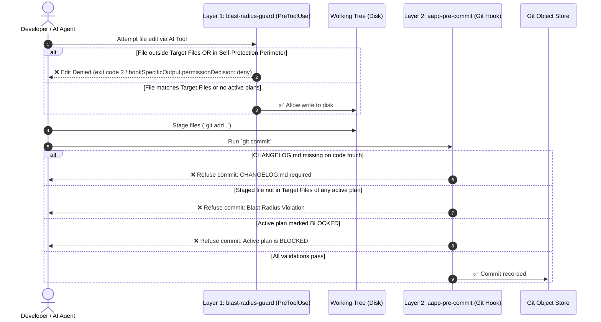

# 📖 Asymmetric Agent Planning Protocol (AAPP) — Technical Manual

> **The comprehensive architecture, operational manual, and technical reference for zero-drift autonomous agent workflows.**

---

## 📑 Table of Contents

* [1. System Architecture & Philosophy](#1-system-architecture--philosophy)
  * [The Problem: Context Pollution and Agent Drift](#the-problem-context-pollution-and-agent-drift)
  * [The Core Primitive: Git Worktrees on Orphan Branches](#the-core-primitive-git-worktrees-on-orphan-branches)
  * [Directory Map and Ownership Model](#directory-map-and-ownership-model)
* [2. Git Plumbing & Worktree Mechanics](#2-git-plumbing--worktree-mechanics)
  * [Under the Hood: Orphan Branches & Worktrees](#under-the-hood-orphan-branches--worktrees)
  * [Remote Synchronization & Multi-Workstation Setup](#remote-synchronization--multi-workstation-setup)
  * [Re-Attaching and Repairing Worktrees](#re-attaching-and-repairing-worktrees)
* [3. Dual-Layer Blast Radius Enforcement Engine](#3-dual-layer-blast-radius-enforcement-engine)
  * [Layer 1: Write-Time PreToolUse Guard (`blast-radius-guard`)](#layer-1-write-time-pretooluse-guard-blast-radius-guard)
  * [Layer 2: Commit-Time Pre-Commit Engine (`aapp-pre-commit`)](#layer-2-commit-time-pre-commit-engine-aapp-pre-commit)
  * [Adaptive Branch Protection & Repository Topologies](#adaptive-branch-protection--repository-topologies)
  * [Parsing Invariants & Prose Isolation](#parsing-invariants--prose-isolation)
  * [Escape Hatches & Fail-Open Design](#escape-hatches--fail-open-design)
* [4. The Two-Lane Protocol: Issues vs. Plans](#4-the-two-lane-protocol-issues-vs-plans)
  * [Strict Lane Separation](#strict-lane-separation)
  * [Flat Issue Ledger Schema (`ISSUES.md`)](#flat-issue-ledger-schema-issuesmd)
  * [The Relocation Invariant & Archival Protocol](#the-relocation-invariant--archival-protocol)
  * [Priority Board (`issues_road_map.md`) & User Priority](#priority-board-issues_road_mapmd--user-priority)
  * [Issue Conciseness Invariant (2–3 Lines Maximum)](#issue-conciseness-invariant-23-lines-maximum)
  * [Issue Promotion Protocol](#issue-promotion-protocol)
  * [Mid-Execution Issue Escape Triage](#mid-execution-issue-escape-triage)
* [5. AAPP State Machine & Lifecycle Commands](#5-aapp-state-machine--lifecycle-commands)
  * [The Lifecycle Pipeline](#the-lifecycle-pipeline)
  * [Repository Onboarding (The Day 1 Loop)](#repository-onboarding-the-day-1-loop)
  * [Command Reference (Universal Skills)](#command-reference-universal-skills)
  * [Master Emergency Brake & State Preserver ("Hibernate & Wake")](#aapp-pause-reason-or-aapp-pause-reason--master-emergency-brake-hibernate)
  * [Token Management & Context Efficiency](#token-management--context-efficiency)
* [6. Agent & IDE Integration Guide](#6-agent--ide-integration-guide)
  * [Google Antigravity Integration](#google-antigravity-integration)
  * [Anthropic Claude Code Integration](#anthropic-claude-code-integration)
  * [Cursor & VS Code Integration](#cursor--vs-code-integration)
  * [GitHub Copilot & Gemini CLI](#github-copilot--gemini-cli)
* [7. Hook Manager Interoperability Recipes & Multi-Language Integration](#7-hook-manager-interoperability-recipes--multi-language-integration)
  * [Subprocess vs. Source Rationale](#subprocess-vs-source-rationale)
  * [The Multi-File Hook Architecture (Master Runner Pattern)](#the-multi-file-hook-architecture-master-runner-pattern)
  * [Polyglot Invocation Cheat Sheet](#polyglot-invocation-cheat-sheet)
  * [Hook Manager Integration Recipes](#hook-manager-integration-recipes)
* [8. Lifecycle Plugin Hooks & Action Plugins Engine](#8-lifecycle-plugin-hooks--action-plugins-engine)
  * [System Architecture & The Pure Planning Invariant](#system-architecture--the-pure-planning-invariant)
  * [Protected Registry & Hash-Lock Contract (`registry.tsv`)](#protected-registry--hash-lock-contract-registrytsv)
  * [The Dual Delivery Contract (STDIN JSON + POSIX Environment)](#the-dual-delivery-contract-stdin-json--posix-environment)
  * [Exit Code Semantics & Watchdog Timeouts](#exit-code-semantics--watchdog-timeouts)
  * [Lifecycle Event Matrix (10 Lifecycle Triggers)](#lifecycle-event-matrix-10-lifecycle-triggers)
  * [Team Sync Governance & Transport Hooks (`aapp.syncStrategy`)](#team-sync-governance--transport-hooks-aappsyncstrategy)
  * [Local Developer Overrides & CI Confinement](#local-developer-overrides--ci-confinement)
  * [CLI Management Suite (`aapp hooks`, `plugins`, `hook-test`, `hook-hash`)](#cli-management-suite-aapp-hooks-plugins-hook-test-hook-hash)
  * [Transparent Command Fallthrough & Polyglot Plugins](#transparent-command-fallthrough--polyglot-plugins)
* [9. AI Attribution Suite & Multi-Vendor Benchmarking](#9-ai-attribution-suite--multi-vendor-benchmarking)
  * [Attribution Models: Trailers vs. Notes Asymmetry](#attribution-models-trailers-vs-notes-asymmetry)
  * [The Switchboard Command Family](#the-switchboard-command-family)
  * [Commit Conciseness Invariant & Commit-Msg Enforcement](#commit-conciseness-invariant--commit-msg-enforcement)
  * [Option C Staged Note Protocol & Amend Durability](#option-c-staged-note-protocol--amend-durability)
  * [The Mode-Boundary Rationale (§E.8)](#the-mode-boundary-rationale-e8)
  * [The AI Contributors Roster (`README.md`)](#the-ai-contributors-roster-readmemd)
* [10. Security, Threat Model & Trust Boundaries](#10-security-threat-model--trust-boundaries)
  * [The Pair-Programming Trust Model](#the-pair-programming-trust-model)
  * [Defense-in-Depth Architecture](#defense-in-depth-architecture)
  * [Why Shell Access Dictates the Containment Boundary](#why-shell-access-dictates-the-containment-boundary)
  * [Structural Gates vs. Brittle Client Flags](#structural-gates-vs-brittle-client-flags)
* [11. Maintenance, Operations & Troubleshooting FAQ](#11-maintenance-operations--troubleshooting-faq)
* [12. Tiered CLI Discovery & Pure-Human Terminal Workflow](#12-tiered-cli-discovery--pure-human-terminal-workflow)
  * [The 5-Tier Discovery Hierarchy](#the-5-tier-discovery-hierarchy)
  * [Zero-Dependency Canonical Manifest (`lib/verbs.tsv`)](#zero-dependency-canonical-manifest-libverbstsv)
  * [Deterministic Blueprint Scaffolding (`aapp draft [slug]`)](#deterministic-blueprint-scaffolding-aapp-draft-slug)
  * [The Pure-Human Terminal Loop](#the-pure-human-terminal-loop)
* [13. Repository Configuration Reference (`git config aapp.*`)](#13-repository-configuration-reference-git-config-aapp)
  * [Complete Configuration Settings Matrix](#complete-configuration-settings-matrix)
  * [Lifecycle & Core Engine Settings](#lifecycle--core-engine-settings)
  * [Branch & Write Guard Protection](#branch--write-guard-protection)
  * [Remote Sync & Worktree Transport](#remote-sync--worktree-transport)
  * [Hook Engine & Local Overrides](#hook-engine--local-overrides)

---

## 1. System Architecture & Philosophy

### The Problem: Context Pollution and Agent Drift

Modern AI coding assistants (Antigravity, Claude Code, Cursor, Copilot) are exceptionally capable at generating code. However, when pair-programming without deterministic boundaries, three systemic failure modes emerge:

1. **Agent Drift & Scope Creep**: An agent tasked with editing a single module discovers a helper function, decides to "clean up" the codebase, refactors working code, and touches 15 unrelated files without human consent.
2. **Context & History Pollution**: Scratchpad notes, architectural thoughts, planning files, and agent conversation artifacts get committed directly to your `main` branch. This pollutes `git log`, creates merge conflicts across feature branches, and confuses release tooling.
3. **Fragile Invariants**: Prompt instructions alone are probabilistic. An agent instructed "do not touch file X" will eventually touch file X if token context compresses or context shifts.

### The Core Primitive: Git Worktrees on Orphan Branches

AAPP solves this structurally through native Git plumbing: **Git Worktrees mounted on isolated Orphan Branches**.

```text
┌────────────────────────────────────────────────────────────────────────┐
│                        MAIN REPOSITORY TREE                            │
│           (Pure application source code, e.g. src/, tests/)             │
└───────┬──────────────────────────┬───────────────────────────┬─────────┘
        │                          │                           │
        ▼                          ▼                           ▼
┌──────────────────┐      ┌──────────────────┐       ┌───────────────────┐
│     .plans/      │      │     .agents/     │       │     .githooks/    │
│  (orphan branch: │      │  (orphan branch: │       │  (orphan branch:  │
│     'plans')     │      │     'agents')    │       │    'githooks')    │
├──────────────────┤      ├──────────────────┤       ├───────────────────┤
│ • current/*.md   │      │ • AGENTS.md      │       │ • pre-commit      │
│ • done/*.md      │      │ • PROJECT.MD     │       │ • aapp-pre-commit │
│ • pickup.md      │      │ • rules/*.md     │       │ • blast-radius-   │
│ • issues_road_   │      │                  │       │   guard           │
│   map.md         │      │                  │       │                   │
│ • state_matrix.md│      │                  │       │                   │
└──────────────────┘      └──────────────────┘       └───────────────────┘
```

By decoupling these concerns into independent Git worktrees:
- Planning notes, task checklists, and architectural matrices **never appear in your application git history**.
- You can switch, rebase, cherry-pick, or reset feature branches in your application code **without losing your active planning scratchpads or agent state**.
- All AI assistants share the exact same ground truth on disk.

### Directory Map and Ownership Model

| Directory / File | Mount Type | Canonical Purpose |
| :--- | :--- | :--- |
| `README.md` | Repo Root | Public overview, installation, and user-facing entrypoint. |
| `CHANGELOG.md` | Repo Root *(or `.plans/`)* | Keep-a-Changelog record of user-facing changes (enforced on code commits; dual-location supported). |
| `ARCHITECTURE.md` | Repo Root *(or `.agents/`)* | Public technical design rules, system constraints, and core abstractions. |
| `.agents/CODEMAP.md` | `agents` worktree *(or root)* | Canonical directory ownership, module boundaries, and entrypoints. |
| `.agents/AGENTS.md` | `agents` worktree | Agent behavioral contracts, protocol rules, and slash command bindings. |
| `.agents/PROJECT.MD` | `agents` worktree | Project-specific personas, milestones, and high-level architectural rules. |
| `.agents/claude/` | `agents` worktree | Canonical Claude Code configuration (`settings.json`). |
| `.agents/skills/` | `agents` worktree | Canonical Universal AAPP Skills (`aapp-*/SKILL.md`). |
| `.claude/` | Gitignored Bridge | Granular symlinks to canonical settings and skills in `.agents/`. |
| `.plans/ISSUES.md` | `plans` worktree *(or root)* | Active flat technical backlog & defect ledger (Relocation Invariant). |
| `.plans/done/000-issues-archive.md` | `plans` worktree | Master historical archive ledger of verified and resolved issues. |
| `.plans/` | `plans` worktree | Active blueprints (`current/`), historical archives (`done/000-archive-ledger.md` & `done/000-issues-archive.md`), scratchpad (`pickup.md`), priority board with ⭐ User Priority (`issues_road_map.md`), and state matrix (`state_matrix.md`). |
| `.githooks/` | `githooks` worktree | Dual-layer blast radius enforcement scripts (`aapp-pre-commit`, `pre-commit`, `blast-radius-guard`). |

---

## 2. Git Plumbing & Worktree Mechanics

### Under the Hood: Orphan Branches & Worktrees

An **orphan branch** in Git is a branch that has no parent commits and shares no common history with the main branch. A **worktree** allows a single repository to have multiple working trees attached simultaneously.

When `aapp init` sets up a worktree (for example `.plans`), it executes a safe, non-destructive Git plumbing algorithm:

```bash
# 1. Check if the orphan branch already exists locally or remotely
if git rev-parse --verify plans >/dev/null 2>&1; then
    # Local branch exists: add worktree attached to it
    git worktree add .plans plans
elif git rev-parse --verify origin/plans >/dev/null 2>&1; then
    # Remote tracking branch exists: track it
    git worktree add --track -b plans .plans origin/plans
else
    # Create new detached worktree and root orphan commit without touching main index
    git worktree add --detach .plans
    (
        cd .plans
        EMPTY_TREE="$(git hash-object -t tree /dev/null 2>/dev/null || echo "4b825dc642cb6eb9a060e54bf8d69288fbee4904")"
        INITIAL_COMMIT="$(git commit-tree "$EMPTY_TREE" -m "chore: initialize plans worktree")"
        git checkout -b plans "$INITIAL_COMMIT" --quiet
    )
fi
```

### Remote Synchronization & Multi-Workstation Setup

Because worktrees are attached to regular Git branches, they can be pushed and pulled to any remote (GitHub, GitLab, self-hosted Git server).

#### Pushing Worktrees to Remote

```bash
# Push planning state to remote
git -C .plans push origin plans

# Push agent contracts to remote
git -C .agents push origin agents

# Push githooks engine to remote
git -C .githooks push origin githooks
```

#### Cloning onto a Second Workstation or CI

When cloning a repository for the first time on a new machine:

```bash
git clone git@github.com:your-org/your-repo.git
cd your-repo

# Initialize AAPP — automatically detects remote orphan branches and mounts worktrees
aapp init
```

`aapp init` detects `origin/plans`, `origin/agents`, and `origin/githooks` and mounts tracking worktrees without generating conflict warnings.

### Re-Attaching and Repairing Worktrees

If a worktree directory is accidentally deleted (`rm -rf .plans`), Git may retain internal reference metadata in `.git/worktrees/plans`. To repair:

```bash
# 1. Prune dead worktree metadata
git worktree prune

# 2. Re-add worktree pointing to existing local branch
git worktree add .plans plans
```

---

## 3. Dual-Layer Blast Radius Enforcement Engine

AAPP provides deterministic safety by enforcing boundaries at two distinct moments in the development lifecycle:



---

### Layer 1: Write-Time PreToolUse Guard (`blast-radius-guard`)

Located at `.githooks/blast-radius-guard`, this executable intercepts AI tool calls before disk writes occur (e.g. Claude Code's `PreToolUse` hook across `Write`, `Edit`, `MultiEdit`, `NotebookEdit`).

#### Evaluation Order & Engine Pipeline:
1. **Input Parsing & Canonicalization**: Standardizes paths using zero-dependency POSIX lexical resolution, collapsing `.` and `..` without dereferencing symlinks to close path traversal escapes while preserving dual-path inode protection.
2. **Section 2 — Self-Protection Perimeter**: AI tools are strictly forbidden from modifying enforcement configuration and governance skills:
   - `.githooks/*`, `.git/hooks/*`, `.git/config`
   - `.claude/settings.json`, `.agents/claude/*`
   - `.agents/skills/aapp-*`, `.claude/skills/aapp-*`
   - `.cursor/rules/*`
3. **Section 2b — External Hard-Deny**: Inviolable credentials, shell startup files, and system binaries are blocked regardless of allowlist breadth:
   - Credentials & keys: `~/.ssh/*`, `~/.gnupg/*`, `~/.aws/*`, `~/.azure/*`, `~/.kube/*`, `~/.docker/config.json`, `~/.netrc`, `~/.npmrc`, `~/.pypirc`, `~/.git-credentials`
   - Git configs: `~/.gitconfig`, `~/.config/git/*`
   - Shell profiles & rc files: `~/.bashrc`, `~/.bash_profile`, `~/.zshrc`, `~/.zprofile`, `~/.profile`, `~/.config/fish/*`
   - Binaries & cron: `~/.local/bin/*`, `*/crontab`
4. **Section 2c — External Path Allowlist**: Authorizes agent scratchpads, memory stores, and caches outside the repository:
   - **Built-in multi-agent defaults**:
     - Claude Code: `$HOME/.claude/` (project memory, session state)
     - Google Antigravity: `$HOME/.gemini/` (artifacts, brain logs, scratchpads)
     - OpenAI Codex: `$HOME/.codex/`
     - Cursor: `$HOME/.cursor/`
     - XDG directories: `$XDG_CONFIG_HOME/`, `$XDG_DATA_HOME/`, `$HOME/.config/`, `$HOME/.local/share/`
     - Temporary scratchpads: `/tmp/`, `$TMPDIR/`, `/var/folders/`
   - **User-configurable allowlist**: Extend via git config:
     ```bash
     git config --add aapp.allowPath "$HOME/.local/state/myagent/"
     ```
   - **Trailing-slash normalization**: All allowlisted directories enforce strict trailing slashes to prevent prefix aliasing (`~/.claude/` never matches `~/.claude_fake/*`).
5. **Section 3 — Always-Allowed Repository Invariants**: Project architecture documents, package manifests, rules, and plans (`.plans/*`, `.agents/*`, `CHANGELOG.md`, `README.md`, `MANUAL.md`, `CHEATSHEET.md`, etc.) are always permitted.
6. **Section 4 — Blast Radius Validation**: If an active, non-blocked plan exists in `.plans/current/*.md`, any write outside the plan's `### 📂 Target Files` (or listed in `### 🛑 Out of Bounds`) is blocked immediately with exit code 2 and a structured failure message.
7. **Tool-Scoped Boundary vs. Layer 2 Gate**: Layer 1 evaluates structured file-writing tools only (`Write`, `Edit`, `MultiEdit`, `NotebookEdit`). Because shell executions (`Bash`) carry command strings rather than structured paths, shell writes cannot be safely parsed; Layer 2 (`aapp-pre-commit`) serves as the strict, inescapable gate for all committed code.
8. **Fail-Open Resilience**: If no active plan exists, or on malformed input, normal repository files are permitted so developer workflows are never bricked.

---

### Layer 2: Commit-Time Pre-Commit Engine (`aapp-pre-commit`)

Located at `.githooks/aapp-pre-commit` (invoked directly or via `.githooks/pre-commit`), this Git hook runs on every `git commit`.

#### Key Responsibilities:
1. **Adaptive Branch Protection**: Prevents accidental direct commits to stable production branches (`main`, `master`, `production`) whenever active development branches exist.
2. **Changelog Enforcement**: Whenever any source code file is modified, `CHANGELOG.md` must be staged. Rules files (`.agents/*`) and planning files (`.plans/*`) are exempt.
3. **Blast Radius Verification**: Compares all staged files against the union of `### 📂 Target Files` across all active blueprints in `.plans/current/*.md`.
4. **Concurrent Plan Support**: If two developers or agents work on separate active plans (`plan-a.md` and `plan-b.md`), files declared in *either* plan are permitted.
5. **Blocked Plan Refusal**: If a plan's status is `🚫 BLOCKED`, commits targeting its files are rejected until the human unblocks the plan.
6. **Syntax Validation**: Automatically runs syntax verification on staged files (e.g., Python `python3 -m py_compile`, PHP `php -l`, JSON syntax).
7. **Roadmap Hygiene**: Automatically prunes resolved issues (`✅` or `Resolved`) from `issues_road_map.md` (<5ms), keeping the priority queue strictly focused on active items while permanent records remain in `ISSUES.md`.

---

### Adaptive Branch Protection & Repository Topologies

AAPP supports two primary development models, adapting automatically without requiring manual configuration:

#### 1. Trunk-Based Development (Single Branch)
In single-branch repositories where developers or teams commit directly to `main` (or `master`):
- No separate development branch (`develop`, `dev`, `development`) exists.
- The pre-commit engine probes local branches (`refs/heads/*`) and remote tracking branches (`refs/remotes/*/*`).
- When no development branch is found, **the branch protection guard automatically fails open**, permitting all commits directly on `main`.

#### 2. Dual-Branch Topology: Stable vs. Edge (Recommended)
In multi-branch repositories, AAPP enforces the **2-Rule Law**:
- **Branch Law**:
  - `main` is strictly **STABLE** (clean semantic release tags `vX.Y.Z`).
  - `develop` (or `dev`) is **EDGE** (active day-to-day engineering and feature development).
- **Release Law**:
  - Active engineering stays on `develop`.
  - Releases fast-forward cleanly into `main` before tagging:
    ```bash
    git checkout main
    git merge develop --ff-only
    git tag -a v1.2.0 -m "Release v1.2.0"
    ```

#### Enforcement & Auto-Detection Algorithm
When committing on a protected branch (`main`, `master`, `production`), the pre-commit engine executes:
```sh
1. Is ALLOW_MAIN_COMMIT=1? -> Allow commit (emergency/release bypass).
2. Is aapp.protectStable configured to false? -> Allow commit (opt-out).
3. Is current branch in $PROTECTED_BRANCHES?
   -> Check if any branch in $DEV_BRANCHES exists:
      - git show-ref --verify --quiet "refs/heads/$DB" (local)
      - git show-ref --verify --quiet "refs/remotes/origin/$DB" (remote origin)
      - git show-ref --quiet -- "refs/remotes/*/$DB" (any remote)
   -> If dev branch exists: Block commit with instructions to switch branches.
   -> If no dev branch exists: Allow commit (trunk-based fallback).
```

#### Configuration Options (`git config`)
You can fine-tune branch protection per-repository or globally:
| Git Config Key | Type | Default | Description |
| :--- | :--- | :--- | :--- |
| `aapp.protectStable` | bool | `true` | Set to `false` to disable branch protection entirely. |
| `aapp.protectedBranches` | string | `"main master production"` | Space-separated list of protected production branches. |
| `aapp.devBranch` | string | `"develop dev development"` | Space-separated list of candidate development branches. |

#### Bypassing Branch Protection
- **Intentional Release or Hotfix Commit on `main`**:
  ```bash
  ALLOW_MAIN_COMMIT=1 git commit -m "hotfix: critical security patch"
  ```
- **Complete Blast Radius & Hook Bypass**:
  ```bash
  SKIP_BLAST_RADIUS=1 git commit -m "emergency bypass"
  ```

---

### Parsing Invariants & Prose Isolation

To prevent accidental scope widening, AAPP uses strict parsing invariants:

- **First-Backtick Rule**: Only the **first** backticked path on a list line in `### 📂 Target Files` is treated as a target path.
  ```markdown
  ### 📂 Target Files
  - [ ] `src/Auth/TokenManager.php` -> Refactor token rotation; see `src/Database/Connection.php` for reference.
  ```
  *Result*: Only `src/Auth/TokenManager.php` is in scope. `src/Database/Connection.php` is treated purely as prose.
- **Directory Prefix Matching**: If a target ends in `/` (e.g. `- [ ] `src/Billing/``), all files within that directory subtree are permitted.
- **Spaces in Filenames**: Correctly parses and matches filepaths containing spaces or special characters.

---

### Escape Hatches & Fail-Open Design

AAPP is designed to assist developers, not trap them.

- **Commit-Time Escape Hatch**:
  ```bash
  SKIP_BLAST_RADIUS=1 git commit -m "emergency: hotfix bypass"
  ```
  Setting `SKIP_BLAST_RADIUS=1` bypasses both CHANGELOG and Blast Radius validation.
- **No-Plan Grace Period**: If `.plans/current/` has no active markdown blueprints, the pre-commit hook allows all commits, ensuring bootstrapping and free-form human commits are never blocked.

---

## 4. The Two-Lane Protocol: Issues vs. Plans

AAPP enforces a strict conceptual separation between **fixing what exists** and **building what does not exist**.

```
                           ┌───────────────────────────┐
                           │      RAW IDEA / INPUT     │
                           └─────────────┬─────────────┘
                                         │
                   Does it describe broken/wrong behavior
                         in existing shipped code?
                                ╱            ╲
                             YES              NO
                             ╱                  ╲
                            ▼                    ▼
               ┌───────────────────────┐   ┌───────────────────────────┐
               │      ISSUE LANE       │   │         PLAN LANE         │
               │  Record in ISSUES.md  │   │  Draft in .plans/current  │
               │  Order on roadmap.md  │   │  Track on state_matrix.md │
               └───────────┬───────────┘   └─────────────┬─────────────┘
                           │                             │
                     Is fix large,                       │
                  multi-module, or RFC?                  │
                         ╱       ╲                       │
                      YES         NO                     │
                      ╱             ╲                    │
                     ▼               ▼                   ▼
            ┌─────────────────┐ ┌─────────┐   ┌────────────────────────┐
            │   PROMOTION     │ │ Direct  │   │  Incubator -> Freeze   │
            │ Draft Blueprint │ │  Patch  │   │     -> Execution       │
            └────────┬────────┘ └─────────┘   └────────────────────────┘
                     │                                   │
                     └───────────────────────────────────┘
```

### Strict Lane Separation

| Property | **Issue Lane** (Bugs & Gaps) | **Plan Lane** (Implementations) |
| :--- | :--- | :--- |
| **Describes** | Something that exists and behaves wrongly | Something that does not exist yet |
| **Canonical Record** | `ISSUES.md` (repo root or `.plans/`) | `.plans/current/<plan>.md` |
| **Priority Ordering** | `.plans/issues_road_map.md` | `.plans/state_matrix.md` |
| **Contents** | Bugs, regressions, edge-case gaps | Features, refactors, new capabilities |
| **Blast Radius?** | No — fixed in place | Yes — locked before execution |

---

### Flat Issue Ledger Schema (`ISSUES.md`)

`ISSUES.md` is strictly an active technical backlog. It consists of a preamble and a single flat database table with **zero subheadings**:

```markdown
| # | Sev | Type | Date | Location | Symptom / Problem | Target Plan / Fix | Status |
| :--- | :--- | :--- | :--- | :--- | :--- | :--- | :--- |
| #49 | `Critical` | `CORE` | 2026-09-10 | `lib/cmd_upgrade.sh:19` | Upgrade clones default branch but main trails develop. | Publish develop to main. | 🟡 `Incubated` |
```

#### Field Specifications:
- **`#`**: Numeric identifier prefixed with `#` (e.g. `#1`, `#49`). Uses unpadded positive integers.
- **`Sev` (Severity)**: Technical impact classification:
  - `Critical`: Core runtime breakage, data corruption, or write-guard bypass.
  - `High`: Major functionality failure or unexpected crash.
  - `Medium`: Isolated feature failure, CLI ergonomics, portability issue.
  - `Low`: Formatting, cosmetic, or documentation drift.
- **`Type` (Extensible Domain Taxonomy)**: Uppercase token conforming to `^[A-Z0-9_-]+$`.
  - **Recommended Core Vocabulary**:
    - `CORE`: Core execution engine, runtime algorithms, language internals.
    - `CLI`: Command-line interface, argument parsing, terminal output, prompts.
    - `UI`: User interface, web views, components, layout, styling, UX.
    - `DB`: Database, ORM, schemas, migrations, persistent storage.
    - `NET`: Networking, API endpoints, HTTP/gRPC, socket protocols, remote sync.
    - `SEC`: Security, authentication, authorization, write guards, sandboxing.
    - `HOOK`: Git hooks, tool use interceptors, lifecycle plugins.
    - `DOCS`: Documentation, README, user manuals, starter templates.
    - `TEST`: Test suites, regression harnesses, CI/CD pipelines, assertions.
    - `PERF`: Performance, memory leaks, latency, caching, stream buffering.
  - **Extensibility Rule**: Projects may declare custom domain tags (e.g., `ML`, `AUDIO`, `3D`). Linters warn on unknown tokens, never block.
- **`Date`**: Date discovered (`YYYY-MM-DD`).
- **`Location`**: File path and line reference (`path/to/file.ext:123`).
- **`Symptom / Problem`**: Exact defect description (2–3 concise sentences maximum).
- **`Target Plan / Fix`**: Direction of fix, or link to promoted blueprint (`current/plan-<name>.md`).
- **`Status`**: `🟡 Incubated` (recorded, unscheduled) · `🔵 Planned` (promoted to a blueprint) · `🟠 In Progress` (active execution).
  *(Note: `✅ Resolved` does NOT exist in this table; resolved items are relocated to `.plans/done/000-issues-archive.md`).*

---

### The Relocation Invariant & Archival Protocol

Active tables hold **ONLY** active items. Resolution is a **physical row relocation** out of `ISSUES.md` and into `.plans/done/000-issues-archive.md`.

#### Archive Schema (`000-issues-archive.md`):
```markdown
# 🏛️ Master Issue Archive Ledger

| # | Sev | Type | Date Opened | Date Resolved | Target Commit / Release | Plan / Resolution Summary |
| :--- | :--- | :--- | :--- | :--- | :--- | :--- |
| #1 | `Critical` | `SEC` | 2026-09-09 | 2026-09-09 | `b9e0daf` (`v1.0.1`) | Added hookSpecificOutput.permissionDecision output. |
```

#### Archival Workflows:
1. **With a Blueprint**: When an issue was promoted to a blueprint, completing the plan via `/aapp-done <plan>` automatically relocates the issue row to `.plans/done/000-issues-archive.md`, records the landing commit hash, and archives the plan.
2. **Direct (Non-Promoted) Fixes**: For small, in-place fixes without a blueprint, the developer or agent manually cuts the row from `ISSUES.md`, appends it to `000-issues-archive.md`, and commits both files.
3. **Commit-Time Enforcement**: `.githooks/aapp-pre-commit` detects any resolved rows (`grep -E '^[[:space:]]*\|[[:space:]]*`?(#|ISSUE-)?[0-9]+`?.*(✅|[Rr]esolved)'`) left in `ISSUES.md` and blocks the commit.

---

### Priority Board (`issues_road_map.md`) & User Priority

`issues_road_map.md` puts active issues into the order you intend to fix them based on human judgement. It includes:
- **`## ⭐ User Priority (Pinned / Immediate Human Focus)`**: Developer overrides for immediate appetite.
- **`## 🔴 High Priority (Technical Urgency)`**: Architecturally critical items.
- **`## 🟡 Medium Priority (Upcoming Iteration)`**: Feature gaps and CLI ergonomics.
- **`## 🟢 Low Priority (Edge Cases & Tooling)`**: Cosmetic and minor tooling items.
- **`## 📥 Triage (Incoming / Unsequenced)`**: Freshly triaged issues awaiting sequencing.

**POSIX ID-Anchored Auto-Pruning**: The pre-commit hook auto-prunes any resolved list item using the POSIX ID-anchored regex `^[[:space:]]*([0-9]+\.|-[[:space:]]*\[[ xX]?\]|\*)[[:space:]]*`?(#|ISSUE-)?[0-9]+`?.*(✅|[Rr]esolved)`, preserving prose headers and explanatory text.

---

### Issue Conciseness Invariant (2–3 Lines Maximum)

To prevent context bloat and keep triage boards scan-friendly:
- **Concise Summaries**: Table entries in `ISSUES.md` must never be long transcripts or essays. State the exact location, the specific symptom, and the 1-line fix direction in **2–3 concise sentences maximum**.
- **The Complexity Rule**: If describing a bug, reproduction steps, or root cause requires multi-paragraph explanations, diagrams, or architectural analysis, **do not bloat `ISSUES.md`**. Log a 2-sentence summary in `ISSUES.md` and immediately promote it to a draft blueprint (`/digest ISSUE-00X`), where full technical blueprints and RFCs belong.

---

### Issue Promotion Protocol

When a bug requires architectural decisions, spans multiple modules, or requires a locked Blast Radius, it is promoted to a plan:

1. **Keep `ISSUES.md` intact**: The issue is never deleted; it remains the record of *what is wrong*.
2. **Draft Blueprint**: Run `/digest ISSUE-00X` to scaffold a blueprint from `.plans/plan-template.md`.
3. **Link Records**:
   - Set `**Target Issue / Milestone:** ISSUE-00X` in the plan.
   - Add the blueprint link to the issue's row in `ISSUES.md`.
4. **Update Status**: Mark the issue as 🔵 `Planned` in `issues_road_map.md`.
5. **Register Plan**: Add the plan to `.plans/state_matrix.md` in the Incubator.
6. **Relocate upon Archive**: Relocate the issue row from `ISSUES.md` to `.plans/done/000-issues-archive.md` only when the plan is implemented, verified, and archived via `/done`. Prune the issue from `issues_road_map.md` (the pre-commit hook automatically purges any resolved items).

---

### Mid-Execution Issue Escape Triage

If an agent discovers an unexpected bug while executing a frozen plan:

1. **Always Record**: Add the bug to `ISSUES.md` immediately.
2. **Evaluate Triage Path**:
   - **Path A: Non-Blocking Bug**: Continue the assigned plan. Do not touch the bug. Append to `issues_road_map.md`.
   - **Path B: Blocking & Small**: Expand the active plan's Blast Radius under an `### 🚨 Emergency Hotfix Extensions` subsection with justification, fix the blocker, and resume.
   - **Path C: Blocking & Substantial**:
     - **STOP execution immediately.**
     - Mark the active plan's status as `🚫 BLOCKED` (`**Blocked On:** ISSUE-00X`).
     - Move the plan to `## 🚫 Blocked` in `state_matrix.md`. (The pre-commit hook will reject any further commits).
     - Present open questions to the human and wait for unblocking.

---

## 5. AAPP State Machine & Lifecycle Commands

### The Lifecycle Pipeline

```
  ┌────────────┐        ┌─────────────┐        ┌──────────────┐        ┌───────────┐
  │  Idea /    │ /digest│  Incubator  │ /freeze│  Greenlight  │ /done  │  Archive  │
  │  pickup.md ├───────►│ 🔴 Draft    ├───────►│  🟢 Ready    ├───────►│  .plans/  │
  │            │        │ 🟡 Refined  │        │  (Execution) │        │  done/    │
  └────────────┘        └─────────────┘        └──────────────┘        └───────────┘
```

### Repository Onboarding (The Day 1 Loop)

When adopting AAPP in an existing codebase or initializing a fresh repository, AAPP intentionally avoids unconstrained setup wizards or external scripts that bypass the planning engine. Instead, onboarding is executed as a **real AAPP blueprint** under a locked Blast Radius:

1. **Initial Seed**: Running `aapp init` pre-seeds `.plans/pickup.md` with:
   ```markdown
   - [ ] Onboarding: Inspect repository codebase to populate .agents/CODEMAP.md, ARCHITECTURE.md, and .agents/PROJECT.MD
   ```
2. **Context Discovery**: Opening your AI agent and running `/aapp-status` (or `aapp status`) immediately reports the queued `Onboarding` item in Pillar 4 (Pickup).
3. **Blueprint Scaffolding**: Running `/aapp-digest Onboarding` drafts a blueprint whose Target Files are strictly confined to `.agents/CODEMAP.md`, `ARCHITECTURE.md`, and `.agents/PROJECT.MD`.
4. **Execution & Self-Cleanup**: Running `/aapp-freeze-start <plan>` greenlights the agent to inspect the codebase (directories, manifests, entrypoints) and replace the generic template placeholders with real project context.
5. **Archival**: Running `/aapp-done <plan>` archives the completed plan to `.plans/done/000-archive-ledger.md`.

Within minutes, both the developer and the agent have experienced the entire 4-pillar lifecycle loop on real repository code.

---

### Command Reference (Universal Skills)

AAPP lifecycle verbs are authored as **Universal AAPP Skills** in `.agents/skills/<name>/SKILL.md` and bridged to `.claude/skills/`. They adhere to standard YAML frontmatter, depth-1 filesystem invariants, progressive disclosure, and the **No-Dead-End Invariant**:

- **No-Dead-End Invariant**: Bare invocations without arguments must never output a dead-end error or fail silently. Skills infer context from active buffers or display candidate menus.
- **Candidate Menu Ceiling**: To prevent chat window bloat and token waste, candidate lists displayed by skills are strictly capped at **10 items** (maximum 15), followed by a single concise overflow summary line (`... and N more [items] (inspect via ...)`).
- **IDE Autocomplete Parity**: All retained skills declare `disable-model-invocation: false` in their frontmatter, ensuring complete visibility in AI IDE slash-command autocompletion (such as Antigravity IDE and Claude Code).

#### `/aapp-status` (or `status`, `aapp status`, `/status`) — Context Recovery
Executed when returning to a project or starting a session. Inspects the workspace and reports across the **Four Pillars**:
1. **Shipped**: Recent entries in `CHANGELOG.md` (`## [Unreleased]`).
2. **Issues**: Top open issues from `ISSUES.md` and `.plans/issues_road_map.md`.
3. **Plans**: Active incubator plans and greenlit tasks in `.plans/state_matrix.md`.
4. **Pickup**: Unprocessed ideas in `.plans/pickup.md` with count.
5. **Next Action**: State-aware next step evaluator dynamically pointing to in-development work, frozen backlog, unprocessed pickup ideas, or top issues.
*Runs inline to preserve full conversation context.*

#### `/aapp-digest [idea]` (or `digest [idea]`, `/digest`) — Targeted Idea Ingestion
Ingests a single idea from `pickup.md`, open issues, or raw text:
- **3-Tier Fallback (Bare Invocations)**:
  1. *Pickup notes*: If `.plans/pickup.md` contains entries, lists them (up to 10) and prompts the user to select one.
  2. *Open issues*: If pickup is empty, lists active issues from `.plans/ISSUES.md` (up to 10) for promotion.
  3. *Inline prompt*: If both are empty, asks the user directly what feature, refactor, or bug to scaffold.
- Routes to Issue Lane (`ISSUES.md`) or Plan Lane (`.plans/current/`).
- Decides whether to **NEW** (scaffold fresh plan) or **AMEND** (fold into existing plan).
- Cross-references `CODEMAP.md` and `ARCHITECTURE.md`.
- Formulates `Open Questions` and leaves status in the Incubator (`🟣 Under Review`).
*Runs inline to read chat notes and interactively query the developer.*

#### `/aapp-freeze [plan]` (or `freeze [plan]`, `/freeze`) — Boundary Lock & Backlog Placement
Transitions a refined blueprint into the Greenlight Backlog:
- Accepts shorthand references: Plan ID (`P-9`, `9`), slug (`guard-path`), or filename (`P9-guard-path-authorization.md`).
- **Bare Fallback**: If called without arguments, scans `.plans/current/` and presents a candidate menu of incubator blueprints (up to 10) ready for freeze.
- Rejects issue references (`#9`) with helpful guidance to preserve lane separation.
- Verifies all Open Questions are answered.
- Validates explicit `### 📂 Target Files` and `### 🛑 Out of Bounds` (enforcing Pair 5 self-protection).
- Changes status to `🔷 Frozen` (or `🔷 Ready for Execution`) and marks Blast Radius `LOCKED`.
- **Design-Lock Immutability**: Once frozen, the plan's specification (`## 2. Technical Blueprint`) and allowlist (`## 4. Blast Radius`) become immutable. Pre-commit strictly refuses commits altering these sections. Execution progress (`## 3.` task checkboxes, `## 5.` open questions, and `## 6.` change log) remains writable.
- **Unfreezing**: To revise a frozen design, revert the plan's status back to `📝 Refining` in an explicit commit before amending the blueprint.

#### `/aapp-start [plan]` (or `start [plan]`) — Implementation Activation
Activates an approved `🔷 Frozen` blueprint from the backlog into active implementation (`⚡ In Development`):
- **Bare Fallback & Auto-Select**: If called without arguments, inspects `.plans/state_matrix.md`:
  - If exactly **one** plan is `🔷 Frozen`, automatically selects and activates it.
  - If multiple plans are frozen, presents a numbered candidate menu (up to 10) for selection.
  - If no plans are frozen, explains that no backlog plans are ready and suggests candidate incubator plans to freeze.
- Runs Disjointness Activation Gate against other in-flight plans in the workspace.
- Transitions status to `⚡ In Development` and sets the local worktree active plan buffer (`.git/aapp_active_plan`).

#### `/aapp-done [plan]` (or `done [plan]`, `/done`) — Master Archival Ledger & Completion
Completes the lifecycle and archives the plan:
- Accepts shorthand references: Plan ID (`P-9`, `9`), slug, or filename.
- **Bare Fallback & Active Inference**: If called without arguments, inspects the local active buffer (`.git/aapp_active_plan`). If an active plan is bound, infers it automatically; otherwise presents in-development plans (up to 10) for selection.
- Moves blueprint: `mv .plans/current/<plan>.md .plans/done/<plan>.md`.
- Appends a 1-line completion record to `.plans/done/000-archive-ledger.md` (recording Plan ID, plan link, target issue, verification commit, and repo-relative impact summary).
- Removes the plan entry from `.plans/state_matrix.md`.
- Verifies tests, linters, and `CHANGELOG.md` entry.

#### `/aapp-pause [reason]` (or `pause [reason]`) — Plan Pause & Master Emergency Brake
Pauses active implementation or quarantines in-flight uncommitted work across mounted worktrees:
- When executed in agent chat, captures completed vs. remaining tasks, records an archival refinement entry, and transitions the blueprint to `⏸️ Paused`.
- When invoked via CLI (`aapp pause [reason]`), quarantines uncommitted modifications into Git stashes and halts write operations.

#### `/plan [idea]` & `/aapp-plan` — Canonical Blueprint Planning & IDE Bridging
- **Canonical Planning Invariant**: Enforces that all implementation plans are saved as version-controlled blueprints in `.plans/current/P<num>-<slug>.md`, overriding ephemeral IDE scratchpads (`implementation_plan.md`).
- **Two-Lane Routing**: Evaluates whether an idea is a bug (routes to `.plans/ISSUES.md` first) or a new capability (scaffolds blueprint).
- **Bare Fallback**: When called without an idea, prompts the developer for the architectural goal or feature requirements.

#### `/aapp-release <version>` (or `release <version>`, `/preflight`) — Release Runbook
Executes `.plans/release/release_checklist.md`:
- Runs full test suites, static analysis, and security checks.
- Enforces Stable vs. Edge branch convention (`develop` cleanly fast-forwards into `main`).
- Validates `CHANGELOG.md` release staging.
- Reports release posture assessment to the developer.
*Execution: Runs in an isolated subagent/fork context (`context: fork`) to keep test logs out of primary chat.*

---

### Command Reference (CLI Fast Commands)

Repetitive terminal operations and administrative switchboards are maintained as fast CLI commands:

- **`aapp freeze-start <plan>`**: Atomically freezes an incubator plan and activates it into `⚡ In Development` in a single command.
- **`aapp active [id]` / `aapp active swap` / `aapp active clear`**: Switchboard for inspecting or switching the local execution buffer (`.git/aapp_active_plan`).
- **`aapp plan-status [id]`**: Read-only inspection of the plan lane matrix or a specific blueprint.
- **`aapp matrix [--check]`**: Re-derives `.plans/state_matrix.md` from the plan files. `--check` audits without writing.
- **`aapp hooks`**: Lifecycle hook diagnostic inspector and dispatcher.

#### `aapp matrix` — Derived State Matrix

`.plans/state_matrix.md` is **generated, not maintained**. The `**Status:**` line inside each `.plans/current/*.md` blueprint is the single source of truth; the matrix is a view derived from it.

```bash
aapp matrix           # check and sync in one pass
aapp matrix --check   # read-only audit: exit 0 in sync, 1 on drift
```

You rarely need to run it by hand. The sync is invoked automatically by `aapp status` (before it reads the matrix) and by `draft`, `freeze`, `freeze-start` and `start` (before they commit), so the board stays correct through normal use.

**What is derived:** each row's status emoji, which section it belongs to, and the section headings themselves (from the status registry, in rank order).

**What is yours and never overwritten:**
- The **Roadmap** block — implementation priority is human judgement.
- Each row's **annotation**, meaning everything after the first ` — `. Annotations are keyed by Plan ID, so a note follows its plan when the plan changes section. They may contain em-dashes of their own.

**Rows are deleted when their plan leaves `.plans/current/`.** A plan archived to `done/`, moved to `aborted/`, renamed or deleted has no matrix row — the archive ledger is the record from then on.

**Unrecognized statuses are surfaced, not hidden.** A blueprint whose `Status:` line matches no registry entry appears in a visible *Unrecognized Status* section instead of being quietly filed under the Incubator, so a typo is obvious rather than invisible.

**While the project is paused**, the sync still writes the matrix but reports that the commit is deferred:

```text
⏸️  [Matrix] Project is PAUSED. state_matrix.md was updated on disk but
   CANNOT be committed until you run 'aapp resume'
```

This is intentional. The pause allowlist admits only `.plans/` pickup, issues and `current/` files, and pausing permits exactly the reflection that moves plans between statuses — so the uncommitted diff is the visible record of how the board changed while you were away.

#### Plan Statuses & Custom Statuses (`aapp.planState.<slug>`)

The shipped statuses are declared in `lib/plan_states.sh`:

| Status | Matrix Section | Rank |
| :--- | :--- | :--- |
| `🟣 Under Review` | Human Thought & Refinement (The Incubator) | 10 |
| `📝 Refining` | Human Thought & Refinement (The Incubator) | 10 |
| `🔷 Frozen` | Frozen & Ready for Coding (The Greenlight Zone) | 20 |
| `⚡ In Development` | In Development (Active Implementation Context) | 30 |
| `🟥 BLOCKED` | Blocked (Halted on an Issue) | 40 |

Statuses are matched by **canonical name**, not by emoji — the glyph is presentation.

Add your own with a four-field tuple (`<emoji>|<name>|<heading>|<rank>`):

```bash
git config aapp.planState.awaiting-review "👀|Awaiting Review|👀 Awaiting External Review|25"
git config --get-regexp '^aapp\.planState\.'   # list what is declared
```

A slug matching a shipped status **overrides** it, letting you reword a section heading without forking the module. A malformed tuple is skipped with a warning rather than breaking `aapp status`.

> **Accessibility:** the shipped glyphs are chosen to be distinguishable under common colour-vision deficiencies, which is why the retired `🔴`/`🟡` pair was removed outright with no alias. When defining custom statuses, prefer glyphs that differ in **shape or symbol** rather than only in hue.

#### `/aapp-pause [reason]` (or `aapp pause [reason]`) — Master Emergency Brake ("Hibernate")
Freezes codebase modifications and quarantees in-flight uncommitted work across all mounted worktrees into Git stashes:
- **Dynamic Worktree Discovery**: Discovers all mounted worktrees via `git worktree list --porcelain`.
- **In-Flight Operation Guard**: Pre-checks for active merges, rebases, or cherry-picks via canonical plumbing (`git rev-parse --git-path MERGE_HEAD`, `rebase-merge`, `CHERRY_PICK_HEAD`). Refuses to pause if an operation is unresolved.
- **Staged File Forensics**: Records the exact list of staged vs. unstaged files in the snapshot before stashing, preserving cherry-picked visibility without fragile index restoration.
- **Air-Gap Safety Invariant**: Strictly uses `git stash push --include-untracked` and forbids `--all`, preserving `.gitignore` boundaries (e.g. private notes in `.plans/pickup/`).
- **Atomic Rollback Invariant**: Asserts that every captured stash SHA is a valid 40-character hexadecimal string; if any worktree fails, all stashes created in that invocation are immediately rolled back, guaranteeing an all-or-nothing operation.
- **State Buffer Scoping**: Defaults to repo-wide `$(git rev-parse --git-common-dir)/aapp_paused` (uncommitted, shared across all linked worktrees). With `--shared`, commits `.plans/PAUSED.md` for remote team freeze.
- **Idempotency**: If the project is already paused, running `aapp pause` acts as a non-destructive inspector.

#### `/aapp-pause resume` (or `aapp resume`, `aapp unpause`) — State Restoration & Wake
Disengages the emergency brake and restores developer velocity:
- **Forensic Drift Detection**: Compares current HEAD commit SHAs across all worktrees against the pause snapshot, reporting foreign commits for human evaluation (without auto-rebasing).
- **SHA-Addressed Stash Restoration**: Restores quarantined stashes explicitly by 40-character commit SHA (immune to stash stack reordering).
- **Pause Buffer Survival & No-Loss Conflict Invariant**: If a merge conflict occurs during stash apply, the stash entry is permanently preserved in `git stash list` and the pause buffer remains active on disk. The project remains PAUSED until conflicts are resolved.
- **Conditional Stash Drop**: Drops stash entries only after clean restoration (exit code 0).
- **Sanity Verification**: Runs `lib/planning_health.sh` across all 7 pairs before deactivating the pause buffer.

#### Circuit Breaker & Cross-Medium Hook Realism ("Uncommittable, Not Untouchable")
When developers work across multiple IDE windows or companion terminals:
- **Layer 1 (Local Session)**: For sessions rooted in this repository, `blast-radius-guard` intercepts write tools before touching disk.
- **Layer 2 (Cross-Repo / External Session)**: For sessions rooted in other directories or plain terminals, Layer 2 (`pre-commit`) serves as the strict, inescapable gate that rejects any commit touching codebase files.
- **Permitted Reflection**: Code reading, Q&A, capturing notes in `.plans/pickup*`, logging defects in `.plans/ISSUES.md` (and `issues_road_map.md`), and drafting blueprints in `.plans/current/` remain 100% operational while paused. All modifications to codebase files, the `.agents/` control plane, templates, and hooks are strictly blocked.
- **Emergency Escape Hatches**: `SKIP_BLAST_RADIUS=1` bypasses Layer 1 and Layer 2; `git commit --no-verify` bypasses Layer 2.

---

### Token Management & Context Efficiency

To optimize LLM context windows and reduce token consumption:
- **Active Focus Only**: When reading `.plans/state_matrix.md`, focus strictly on active sections (`Roadmap`, `1. The Incubator`, and `2. The Greenlight Zone`).
- **Archive Isolation**: Historical blueprints in `.plans/done/` and the master ledger `.plans/done/000-archive-ledger.md` are isolated archives; agents should not load them unless specifically requested by the user for an architectural audit or historical lookup.

---

## 6. Agent & IDE Integration Guide

### Google Antigravity Integration

Antigravity natively discovers workspace rules and skills.

1. **Workspace Rules**: AAPP rules in `.agents/AGENTS.md` and `.agents/PROJECT.MD` are automatically indexed.
2. **Planning Mode Alignment**: Antigravity's internal planning mode seamlessly maps to `.plans/current/*.md` blueprints and `/freeze` workflows.

---

### Anthropic Claude Code Integration

AAPP integrates with Claude Code's tool execution lifecycle and slash command engine:

1. **Configuration Decoupling (`.agents/claude/settings.json`)**:
   Canonical settings live inside the orphan `agents` worktree. The local repository directory `.claude/` is gitignored on application branches, and `.claude/settings.json` is maintained as a granular relative symlink (`../.agents/claude/settings.json`).
   ```json
   {
     "hooks": {
       "PreToolUse": [
         {
           "matcher": "Write|Edit|NotebookEdit",
           "hooks": [
             {
               "type": "command",
               "command": "${CLAUDE_PROJECT_DIR}/.githooks/blast-radius-guard"
             }
           ]
         }
       ]
     }
   }
   ```
2. **Slash Command Bridging (`.claude/skills/`)**:
   `aapp init` bridges Universal Skills from `.agents/skills/aapp-*` into `.claude/skills/aapp-*` via granular relative symlinks (with directory copy fallback on Windows). Claude Code exposes these as `/aapp-status`, `/aapp-digest`, `/aapp-freeze`, `/aapp-done`, and `/aapp-release`.
3. **Write-Time Interception**: Claude Code passes JSON payloads to `.githooks/blast-radius-guard`. If a tool targets a file outside `### 📂 Target Files`, the tool execution is aborted with a structured failure message. Section 2 self-protection denies modifications to `.agents/claude/*` and `.claude/settings.json` on both sides of symlinks.

---

### Cursor & VS Code Integration

1. **Multi-Root Workspaces**: `.plans/`, `.agents/`, and `.githooks/` appear as standard workspace directories in the VS Code sidebar.
2. **Cursor Rules**: Symlink or mirror `.agents/AGENTS.md` to `.cursor/rules/aapp.mdc` or `.cursorrules`.

---

### GitHub Copilot & Gemini CLI

Add a workspace instruction pointing to `.agents/AGENTS.md` so Copilot and Gemini CLI adhere to the Two Lanes rule, Changelog enforcement, and attribution trailers.

---

## 7. Hook Manager Interoperability Recipes & Multi-Language Integration

If your project already uses custom pre-commit hooks (in Perl, Python, Node, Ruby, or Bash) or uses a hook manager like Husky/Lefthook, AAPP's blast-radius engine runs alongside them safely without interfering.

### Subprocess vs. Source Rationale

> [!IMPORTANT]
> **Always wire hooks as a subprocess (`"path/to/hook" || exit 1`) rather than `source` or `exec`.**
> 
> - `source .githooks/aapp-pre-commit`: Shares shell variables and execution scope, meaning an internal `exit 0` in a child script will terminate the parent hook immediately, skipping your remaining linters.
> - `exec .githooks/aapp-pre-commit`: Replaces the current process image entirely, preventing any subsequent commands from running.
> - **`".../.githooks/aapp-pre-commit" || exit 1`**: Runs in an isolated subprocess. Exit code `0` continues execution; exit code `1` aborts the commit cleanly and propagates `SKIP_BLAST_RADIUS=1` correctly.

---

### The Multi-File Hook Architecture (Master Runner Pattern)

When your project has multiple specialized checks (e.g. AAPP blast radius + Perl linter + Python type checker + Prettier), structure your `.githooks/` worktree cleanly with modular scripts coordinated by a master `pre-commit` runner:

```text
.githooks/
├── pre-commit              # Master executable runner (dispatches all checks)
├── aapp-pre-commit         # AAPP commit-time blast radius engine (managed by AAPP)
├── blast-radius-guard      # AAPP write-time guard (PreToolUse)
├── lint-perl.pl            # Custom Perl linter
├── check-types.py          # Custom Python / mypy check
└── format.sh               # Shell / Prettier formatting check
```

#### Master Runner (`.githooks/pre-commit`):
```bash
#!/usr/bin/env bash
set -e
REPO_ROOT="$(git rev-parse --show-toplevel)"

# 1. AAPP Blast Radius & Changelog Enforcement (must run first)
"$REPO_ROOT/.githooks/aapp-pre-commit" || exit 1

# 2. Custom Perl Linters / Tests
if [ -f "$REPO_ROOT/.githooks/lint-perl.pl" ]; then
    perl "$REPO_ROOT/.githooks/lint-perl.pl" || exit 1
fi

# 3. Custom Python / Node Checks
if [ -f "$REPO_ROOT/.githooks/check-types.py" ]; then
    python3 "$REPO_ROOT/.githooks/check-types.py" || exit 1
fi

echo "✅ All pre-commit checks passed!"
```

---

### Polyglot Invocation Cheat Sheet

If your primary pre-commit hook is written in a language other than Bash, here is how to invoke the AAPP pre-commit engine safely:

#### 1. Perl (`pre-commit` in Perl)
```perl
#!/usr/bin/env perl
use strict;
use warnings;

# --- Run AAPP Blast Radius Engine ---
my $repo_root = `git rev-parse --show-toplevel`;
chomp($repo_root);
my $aapp_hook = "$repo_root/.githooks/aapp-pre-commit";

if (-x $aapp_hook) {
    system($aapp_hook) == 0 or exit 1;
}

# --- Project-Specific Perl Checks ---
# ... your custom Perl linting / validation code ...
```

#### 2. Python (`pre-commit` in Python)
```python
#!/usr/bin/env python3
import subprocess, sys

# --- Run AAPP Blast Radius Engine ---
repo_root = subprocess.check_output(["git", "rev-parse", "--show-toplevel"], text=True).strip()
res = subprocess.run([f"{repo_root}/.githooks/aapp-pre-commit"])
if res.returncode != 0:
    sys.exit(res.returncode)

# --- Project-Specific Python Checks ---
# ... your custom Python validation code ...
```

#### 3. Node.js / JavaScript (`pre-commit` in Node)
```javascript
#!/usr/bin/env node
const { execSync } = require('child_process');

// --- Run AAPP Blast Radius Engine ---
const repoRoot = execSync('git rev-parse --show-toplevel', { encoding: 'utf-8' }).trim();
try {
  execSync(`"${repoRoot}/.githooks/aapp-pre-commit"`, { stdio: 'inherit' });
} catch (error) {
  process.exit(1);
}

// --- Project-Specific JS/TS Checks ---
```

#### 4. Ruby (`pre-commit` in Ruby)
```ruby
#!/usr/bin/env ruby

# --- Run AAPP Blast Radius Engine ---
repo_root = `git rev-parse --show-toplevel`.strip
system("#{repo_root}/.githooks/aapp-pre-commit") || exit(1)

# --- Project-Specific Ruby Checks ---
```

---

### Hook Manager Integration Recipes

#### Husky (`.husky/pre-commit`)
```sh
#!/usr/bin/env sh
. "$(dirname -- "$0")/_/husky.sh"

# Run AAPP Blast Radius Engine
"$(git rev-parse --show-toplevel)/.githooks/aapp-pre-commit" || exit 1

# Run project linting
npm run lint-staged
```

#### Lefthook (`lefthook.yml`)
```yaml
pre-commit:
  commands:
    aapp-blast-radius:
      run: "$(git rev-parse --show-toplevel)/.githooks/aapp-pre-commit"
    lint:
      run: npm run lint
```

#### Pre-Commit Framework (`.pre-commit-config.yaml`)
```yaml
repos:
  - repo: local
    hooks:
      - id: aapp-blast-radius
        name: AAPP Blast Radius Engine
        entry: .githooks/aapp-pre-commit
        language: script
        pass_filenames: false
```

---

### Linked Worktree Hook Architecture & Universal Dispatching

AAPP enforces commit governance, blast radius boundaries, and AI attribution policies across all project worktrees (including isolated orphan worktrees like `.plans` and `.agents`).

#### Two-Tier Hook Architecture
Git hooks in AAPP follow a two-tier structure:
1. **Tier 1: Master Dispatcher Wrappers (`templates/commit-msg`, `templates/pre-commit`, `templates/post-commit`)**: The project-level entrypoints stored in `.githooks/`. They resolve the primary project root via `git rev-parse --git-common-dir` and invoke the namespaced AAPP engines alongside custom user checks.
2. **Tier 2: AAPP Enforcement Engines (`templates/aapp-commit-msg`, `templates/aapp-pre-commit`, `templates/aapp-post-commit`)**: Core policy and blast-radius engines managed deterministically by AAPP.

#### Universal Root Resolution (`--git-common-dir`)
Inside linked worktrees, `git rev-parse --show-toplevel` points to the worktree root (e.g. `/repo/.plans`), which does not contain the shared project `.githooks/`. AAPP wrappers and custom hook recipes resolve the primary repository root via `git rev-parse --git-common-dir`:

```bash
COMMON_DIR="$(git rev-parse --git-common-dir 2>/dev/null || echo ".git")"
PRIMARY_ROOT="$(cd "$COMMON_DIR/.." 2>/dev/null && pwd || true)"
HOOK_DIR="$PRIMARY_ROOT/.githooks"

if [ -f "$HOOK_DIR/aapp-commit-msg" ]; then
    bash "$HOOK_DIR/aapp-commit-msg" "$@" || exit 1
fi
```

#### Dual Defense-in-Depth Wiring
1. **Symlink Seeding**: During `aapp init`, AAPP seeds symbolic links (`.plans/.githooks -> ../.githooks` and `.agents/.githooks -> ../.githooks`). This ensures Git's native `core.hooksPath = .githooks` discovery mechanism automatically intercepts commits originating inside linked worktrees.
2. **Ignore Hygiene**: `.plans/.gitignore` and `.agents/.gitignore` explicitly ignore `.githooks` to prevent untracked symlinks from bleeding into version-controlled orphan branches.

---

### Test Suite Harness & Sandbox Confinement Invariant

All automated test suites in AAPP source `tests/test_helpers.sh` to enforce strict sandbox confinement and headless reliability:

* **Fail-Closed Sandbox Assertion (`assert_test_sandbox`)**:
  Every test fixture must verify that its target execution directory is strictly confined to a temporary sandbox (e.g. `/tmp/`, `$RUNNER_TEMP`, `$TMPDIR`). The assertion inspects `git rev-parse --git-common-dir` to ensure test operations never accidentally mutate the host repository or its linked worktrees. If `AAPP_TEST_SANDBOX_STRICT=1` (default), any unconfined directory immediately triggers a hard error (`exit 1`).
* **Dynamic Developer Identity Inheritance (`setup_test_git_identity`)**:
  Test sandboxes inherit the active developer's Git name and email (falling back to standard mock identity on headless CI environments), completely eliminating hardcoded test emails (such as `T <t@t>`).
* **Non-Interactive GPG Bypass**:
  Test repository initialization explicitly sets `commit.gpgsign false` and `tag.gpgsign false`. This guarantees tests run headlessly without triggering interactive GPG pinentry prompts or failing on environments with mandatory commit signing configured globally.

---

## 8. Lifecycle Plugin Hooks & Action Plugins Engine

AAPP provides an extensible, zero-dependency lifecycle hook and action plugin engine. It allows external scripts, linters, quality ratchets (e.g. fallback detectors), remote sync transports, and issue trackers (Jira, Linear, GitHub Issues) to intercept planning events via standard POSIX stdio contracts.

```text
┌────────────────────────────────────────────────────────────────────────┐
│                        AAPP LIFECYCLE ENGINE                           │
│  (on-freeze, on-start, on-done, on-pause, on-resume, on-sync, ...)     │
└──────────────────────────────────┬─────────────────────────────────────┘
                                   │
                                   ▼
┌────────────────────────────────────────────────────────────────────────┐
│                     FAIL-CLOSED INTEGRITY CHECK                        │
│   • Parse .agents/skills/aapp-hooks/registry.tsv (5 columns)           │
│   • Compute SHA256 of entrypoint via portable resolution chain         │
│   • Verify hash matches expected_sha256 (Anti-Self-Modification Gate)  │
└──────────────────────────────────┬─────────────────────────────────────┘
                                   │
                                   ▼
┌────────────────────────────────────────────────────────────────────────┐
│                        DUAL DELIVERY DISPATCH                          │
│   • STDIN: Stream full JSON envelope (event, plan metadata, actor)     │
│   • POSIX ENV: Export AAPP_EVENT, AAPP_PLAN_ID, AAPP_ACTION, etc.      │
│   • Watchdog: Enforce timeout (default 10s) with POSIX subshell timer  │
│   • Mode: 'gate' (exit 1 aborts) vs. 'notify' (exit 1 warns)           │
└────────────────────────────────────────────────────────────────────────┘
```

### System Architecture & The Pure Planning Invariant

1. **Pure Planning Invariant**: `.plans/` is reserved strictly for human-readable planning markdown (blueprints, issues, pickup queue, archive ledgers). Executable hook scripts and registry files **never live in `.plans/`**.
2. **Anti-Self-Modification Gate**: Section 2 of `blast-radius-guard` permanently protects `.agents/skills/aapp-*` from agent writes. If hook registration lived in an unprotected directory, an agent encountering a quality gate (like a fallback ratchet) could simply rewrite the hook script or repoint the registry to exit 0. By housing the registry in `.agents/skills/aapp-hooks/registry.tsv` and verifying each entrypoint's SHA256 before execution, neither the registry nor the handler scripts can be silently modified without invalidating the recorded hash and aborting the lifecycle operation.

---

### Protected Registry & Hash-Lock Contract (`registry.tsv`)

The hook registry is a tab-delimited, line-oriented flat file (`.agents/skills/aapp-hooks/registry.tsv`) conforming to a strict 5-column schema:

```tsv
# event<TAB>handler_path<TAB>expected_sha256<TAB>timeout<TAB>mode
on-freeze	.agents/skills/migration-guard/scripts/check.sh	sha256:9f3c8e4...	30	gate
on-done	.agents/skills/archiver/scripts/push.sh	sha256:1a7e2b8...	60	notify
on-sync	.agents/skills/team-transport/sync.sh	sha256:4d8a1c3...	45	gate
```

* **5-Column Schema**:
  1. `event`: The lifecycle trigger name (e.g. `on-freeze`, `on-done`, `on-sync`).
  2. `handler_path`: Relative repository path to the executable script or binary.
  3. `expected_sha256`: Expected SHA256 checksum prefixed with `sha256:`.
  4. `timeout`: Execution timeout in seconds (positive integer; defaults to `10` if empty or omitted).
  5. `mode`: Execution mode — `gate` (fails closed, aborts lifecycle on failure/timeout) or `notify` (logs advisory warning and proceeds). Defaults to `gate`.
* **Pure POSIX Line Parsing**: Parsed using `TAB=$(printf '\t')` to guarantee 100% compatibility with `dash` (`/bin/sh` on Debian/Ubuntu), avoiding non-portable bashisms (`$'\t'`). Malformed lines with unexpected 6th fields are rejected with an explicit error.
* **Portable SHA256 Resolution Chain (Fail-Closed)**: Computes hashes dynamically by resolving host binaries: `sha256sum` (Linux) -> `shasum -a 256` (macOS) -> `sha256` (BSD) -> `openssl dgst -sha256`. If no SHA256 utility exists on the system, the dispatcher hard-aborts.
* **Integrity Gate**: If the live file's SHA256 does not match `expected_sha256`, the lifecycle transition is refused with an integrity violation diagnostic.
* **Multi-Hook Multiplexing**: Multiple handlers may bind to the same event. They execute sequentially in order of registration.

---

### The Dual Delivery Contract (STDIN JSON + POSIX Environment)

To accommodate both zero-dependency shell scripts and rich polyglot webhook integrations, AAPP dispatches events via **Dual Delivery**:

#### 1. JSON Envelope on `stdin`
Handlers receive a structured JSON payload on standard input containing metadata and event-specific context:
```json
{
  "event": "on-done",
  "timestamp": "2026-09-19T21:30:00Z",
  "pid": 12345,
  "actor": "lorand",
  "repo_root": "/path/to/project",
  "plan": {
    "id": "P-12",
    "file": ".plans/current/P12-lifecycle-hooks.md",
    "status": "⚡ In Development"
  },
  "data": {
    "archive_file": ".plans/done/P12-lifecycle-hooks.md"
  }
}
```

#### 2. Exported POSIX Environment Variables
For shell scripts that avoid parsing JSON, standard variables are exported into the handler's execution environment:
* `AAPP_EVENT`: Name of the triggering lifecycle event (e.g. `on-done`).
* `AAPP_PLAN_ID`: Identifier of the associated plan (e.g. `P-12`).
* `AAPP_PLAN_FILE`: Path to the plan blueprint.
* `AAPP_ACTION`: Specific sub-action for composite events (e.g. `push`, `pull`, `sync`).
* `AAPP_REMOTE`: Target remote repository (e.g. `origin`).
* `AAPP_MODE`: Handler mode (`gate` or `notify`).
* `AAPP_TIMEOUT`: Execution timeout in seconds.
* `AAPP_ACTOR`: Current system user executing the command.

---

### Exit Code Semantics & Watchdog Timeouts

Handlers communicate their results through standard POSIX process exit codes:

| Exit Code | Gate Mode (`gate`) | Notify Mode (`notify`) | Semantic Meaning |
| :---: | :--- | :--- | :--- |
| `0` | **Pass**: Operation proceeds. | **Pass**: Operation proceeds. | Success / Validated |
| `1` | **Hard Abort**: Lifecycle operation cancelled immediately; stderr streamed. | **Warning**: Diagnostic logged; operation proceeds. | Validation failure or fatal error |
| `2` | **Advisory Warning**: Diagnostic logged; operation proceeds. | **Advisory Warning**: Diagnostic logged; operation proceeds. | Non-fatal check warning |
| `124` | **Hard Abort**: Process terminated by watchdog timeout; operation cancelled. | **Warning**: Timeout logged; operation proceeds. | Watchdog timeout exceeded |
| Other | **Hard Abort**: Treated as Exit Code 1. | **Warning**: Treated as Exit Code 1. | Non-standard failure |

#### Subprocess Watchdog
Every handler executes under an automated watchdog timer running in an isolated subshell. If the handler exceeds its configured `timeout`, the watchdog terminates the handler process with `SIGTERM` (followed by `SIGKILL` if unresponsive) and returns exit code 124.

---

### Lifecycle Event Matrix (10 Lifecycle Triggers)

AAPP wires 10 distinct lifecycle events across all planning and workflow operations:

| Event | Triggering Command | Default Mode | Delivered Context (`data`) |
| :--- | :--- | :---: | :--- |
| `on-pickup` | `/aapp-digest` / `aapp digest` | `notify` | Idea text or pickup file being ingested. |
| `on-digest` | `/aapp-digest` / `aapp digest` | `gate` | Scaffolded draft blueprint path & Plan ID. |
| `on-freeze` | `/aapp-freeze` / `aapp freeze` | `gate` | Plan ID, declared Target Files, locked blueprint path. |
| `on-start` | `/aapp-start` / `aapp start` | `gate` | Plan ID, status transition to `⚡ In Development`. |
| `on-done` | `/aapp-done` / `aapp done` | `notify` | Plan ID, destination archive path in `.plans/done/`. |
| `on-pause` | `/aapp-pause` / `aapp pause` | `gate` | Pause reason, dirty worktree inventory, pause buffer path. |
| `on-resume` | `/aapp-resume` / `aapp resume` | `gate` | Restored plan ID, restored worktree count. |
| `pre-sync` | `aapp push`, `pull`, `sync` | `notify` | Action (`push`/`pull`/`sync`), remote, worktrees. |
| `on-sync` | `aapp push`, `pull`, `sync` | `gate` | Action, remote, worktrees (transports remote state). |
| `post-sync` | `aapp push`, `pull`, `sync` | `notify` | Action, remote, worktrees, transport result. |

---

### Reference Samples, The `.sample` Convention & CLI Discovery

AAPP ships browsable, production-grade reference examples for action plugins and lifecycle hooks under `examples/` (`examples/plugins/`, `examples/hooks/`).

#### 1. The `.sample` Invariant (Zero Accidental Execution)
Mirroring Git's canonical `.git/hooks/*.sample` pattern, all reference scripts and provider mocks strictly carry the `.sample` extension (e.g. `run.sample`, `on-done-sync.sh.sample`).
- **Resolver Filtering**: `resolve_plugin_entrypoint` and `aapp` switchboard explicitly ignore `*.sample` files, ensuring that reference samples cannot be executed by accident even if marked executable.
- **Hook Registry Audit**: If a `.sample` script is registered in `registry.tsv`, `aapp hooks` audits it with an advisory `⚠️  INERT SAMPLE` badge.

#### 2. Centralized Storage vs. Drop-in Zero-Footprint Isolation
- **Global Installation (`aapp install`)**: Samples are preserved centrally in `~/.local/share/aapp-kit/examples/` (`$SHARE_DIR/examples/`) and refreshed on each upgrade.
- **Drop-in Mode (`./aapp-kit/aapp init`)**: Drop-in mode maintains 100% self-containment. Samples are not extracted into `.agents/skills/` or written to `$SHARE_DIR`. The `.agents/` worktree remains free of inert sample mocks, protecting AI agent context windows from token bloat.

#### 3. Dynamic CLI Discovery
Run `aapp plugins` and `aapp hooks` to discover available samples:
- `aapp plugins`: Inspects active plugins, reports standard extension points (`aapp-planid`, `hello-tool`), and displays available samples with copy commands.
- `aapp hooks`: Displays registered lifecycle hooks, timing taxonomy, and available reference hook samples.

#### 4. Adopting a Sample
To activate a sample, copy it into place and strip the `.sample` suffix:
```bash
# Adopt custom action plugin:
cp -r ~/.local/share/aapp-kit/examples/plugins/hello-tool .agents/skills/hello-tool
mv .agents/skills/hello-tool/run.sample .agents/skills/hello-tool/run
chmod +x .agents/skills/hello-tool/run

# Adopt lifecycle hook:
cp ~/.local/share/aapp-kit/examples/hooks/on-done-sync.sh.sample .githooks/on-done-sync.sh
chmod +x .githooks/on-done-sync.sh
aapp hook-hash .githooks/on-done-sync.sh on-done 10 notify >> .agents/skills/aapp-hooks/registry.tsv
```

---

### Plan ID Allocation (`aapp.planId`) & the `aapp-planid` Provider

Plan IDs are **stored, not derived**. `aapp.planId` holds the *next* id to hand out, as a bare integer — the `P-` prefix is a namespace marker applied on output to separate a plan id (`P-22`) from an issue id (`#22`), and is never part of the stored value.

```bash
git config --get aapp.planId     # inspect the next id
aapp init                        # seeds it; 1 on a brand-new project
```

`aapp init` seeds the counter once by scanning `.plans/current`, `.plans/done` and `.plans/aborted` plus the archive ledger. **A numeric value is then left alone** — re-running `init`, including the `init` that follows `aapp upgrade`, never disturbs a live counter. Seeding only happens when the key is absent or non-numeric.

If the key is corrupted, allocation **refuses** rather than restarting the sequence at `P-1` (which would collide with every existing plan). Run `aapp init` to reseed it.

#### Solo vs. multi-contributor

| Setup | What you need |
| :--- | :--- |
| **Solo developer** | Nothing. The local counter is sufficient and cannot drift — you are the only allocator. |
| **Any repository with more than one contributor** | An `aapp-planid` provider plugin backed by a central authority. Git config is never pushed, so two contributors would otherwise allocate the same id independently. |

#### Installing a provider

The provider is an **action plugin you supply**. Unlike every other `aapp-*` skill, it does **not** ship with `aapp init`:

```
.agents/skills/aapp-planid/run          # canonical path -- this exact name
```

A working reference lives at `examples/plugins/aapp-planid/run.sample` (stored centrally in `~/.local/share/aapp-kit/examples/plugins/aapp-planid/` for global installations). To adopt it, copy the directory into `.agents/skills/aapp-planid` and rename `run.sample` to `run`:
```bash
cp -r ~/.local/share/aapp-kit/examples/plugins/aapp-planid .agents/skills/
mv .agents/skills/aapp-planid/run.sample .agents/skills/aapp-planid/run
chmod +x .agents/skills/aapp-planid/run
```
Because the path begins with `aapp-`, it is protected by Guard Section 2 — agents cannot rewrite your ID authority.

**Contract:**

| | |
| :--- | :--- |
| **stdout** | One plan id, either `P-42` or bare `42` |
| **exit 0** | Id issued |
| **exit non-zero** | Refuse — AAPP aborts allocation |

Only plugin **absence** falls back to the local counter. A plugin that is present and fails is **fatal**, never a silent local allocation — falling back on failure would reintroduce exactly the collision the provider exists to prevent.

#### Security: your provider, your responsibility

AAPP defines the contract above and nothing more. It does **not** inspect, validate or constrain what a provider contains — and cannot, since providers are extension-agnostic and may be compiled binaries.

* Anything committed into the repository is **cloned, forked and public**. A credential placed in a provider is in history permanently.
* The recommended pattern is the shipped sample: a one-line delegation to an out-of-repo command, keeping logic and secrets outside version control.

  ```sh
  #!/bin/sh
  exec "${AAPP_PLANID_CMD:-$HOME/.local/bin/aapp-planid-provider}" "$@"
  ```

  `$HOME/.local/bin/` is chosen deliberately: Guard Section 2b hard-denies it to agents. Do **not** default into `~/.config` or `~/.local/share` — both are on the Section 2c agent-write allowlist.
* This is a **documented responsibility, not an enforced guarantee**. AAPP cannot protect an adopter who commits a secret into their provider, and does not claim to.

---

### Team Sync Governance & Transport Hooks (`aapp.syncStrategy`)

For teams collaborating via custom infrastructure (e.g. S3 buckets, central databases, or internal git mirrors), remote synchronization can be delegated to a team plugin hook (`on-sync`). AAPP establishes a strict three-tier precedence hierarchy:

```text
1. CLI Positional Strategy Override
   aapp push origin hook  (or: aapp sync origin builtin)
        │
        ▼ (if not specified on CLI)
2. Local Developer Configuration
   git config aapp.syncStrategy [builtin|hook]
        │
        ▼ (if unset in .git/config)
3. Repository Team Standard
   • Defaults to 'hook' if an 'on-sync' handler is registered in registry.tsv
   • Defaults to 'builtin' otherwise
```

#### Fail-Closed Transport Invariant
If `aapp.syncStrategy` resolves to `hook` but no executable handler is registered in `.agents/skills/aapp-hooks/registry.tsv` or git config, AAPP **strictly refuses** the operation:
```text
❌ aapp.syncStrategy=hook but no executable handler is registered for on-sync in .agents/skills/aapp-hooks/registry.tsv or git config.
```
Silently degrading to `builtin` or doing nothing is forbidden — refusal is the only outcome where a configuration error is immediately visible.

---

### Local Developer Overrides & CI Confinement

Developers can register local observation hooks in `.git/config` without modifying committed files:
```bash
git config --add aapp.hook.on-done "/path/to/local/desktop-notify.sh"
```

* **Observation Invariant**: Local git config hooks run **exclusively in `mode=notify`**. They can observe events, stream notifications, or play audio alerts, but can **never gate or abort** a lifecycle transition. Only committed handlers in `registry.tsv` can gate.
* **CI Confinement**: In CI/CD pipelines or strict build runners, uncommitted hooks are disabled by setting:
  ```bash
  git config aapp.allowLocalHooks false
  ```

---

### CLI Management Suite (`aapp hooks`, `plugins`, `hook-test`, `hook-hash`)

AAPP provides dedicated CLI commands for managing and testing hooks:

* **`aapp hooks`**: Audits all registered lifecycle hooks. Validates file existence, executable bit (`+x`), and live SHA256 integrity against `registry.tsv`:
  ```text
  🪝 AAPP Lifecycle Hook Registry (.agents/skills/aapp-hooks/registry.tsv)
    • on-freeze -> .agents/skills/migration-guard/scripts/check.sh [gate, 30s] (hash: valid)
    • on-done   -> .agents/skills/archiver/scripts/push.sh [notify, 60s] (hash: valid)
  ```
* **`aapp plugins`**: Scans `.agents/skills/` and lists all discovered Action Plugins with their resolved entrypoints.
* **`aapp hook-test <event> [plan-id]`**: Dry-runs registered handlers for a lifecycle event with mock payload data, testing timeout watchdog and exit code semantics without modifying repository state.
* **`aapp hook-hash <file> [event] [timeout] [mode]`**: Helper utility that computes the portable SHA256 of `<file>` and outputs a formatted 5-column TSV line ready to paste into `registry.tsv`.

---

### Transparent Command Fallthrough & Polyglot Plugins

Action Plugins are standalone CLI tools authored as project skills in `.agents/skills/<name>/`.

#### Extension-Agnostic Resolution Invariant
Plugin discovery **never relies on a specific script extension (`.sh`)**. When `aapp <cmd> [args...]` is called and `<cmd>` is not a core built-in command, the CLI switchboard scans `.agents/skills/$CMD/` in deterministic order:
1. `run` or `$CMD` (extensionless executable binary or shebang script)
2. `scripts/run` or `scripts/$CMD` (extensionless executable in subfolder)
3. Any executable matching `$CMD.*` or `run.*` (e.g. `.py`, `.sh`, `.bash`, `.js`, `.rb`)
4. Any executable in `scripts/` matching `$CMD.*` or `run.*`

When an entrypoint matches, AAPP immediately delegates execution via `exec "$CANDIDATE" "$@"`, forwarding all standard streams, arguments, and process exit codes without overhead.

---

## 9. AI Attribution Suite & Multi-Vendor Benchmarking

AAPP replaces legacy synthetic co-author email trailers (`Co-authored-by: Agent <agent@vendor.com>`) with an explicit, multi-mode AI attribution suite governed by repository configuration (`git config aapp.aiAttribution`).

### Attribution Models: Trailers vs. Notes Asymmetry

Public git servers (such as GitHub) scan commit trailers for `Co-authored-by:` email addresses. When synthetic addresses (such as `antigravity@google.com`) are present, GitHub matches unrelated accounts in its global registry that verified that email, permanently misattributing repository contributions. Furthermore, human email addresses force external account linkage.

AAPP introduces two distinct, purpose-driven attribution channels:

| Mode | Command | Target Ref / Layer | Visibility & Durability |
| :--- | :--- | :--- | :--- |
| `none` | `aapp ai-off` | Working tree only | **Default.** Pure human authoring. Accidental AI trailers are blocked by `commit-msg`. |
| `commit` | `aapp ai-commit` | Commit object trailers | **Public attribution.** Emailless semantic trailers (`AI-Agent:`, `AI-Vendor:`, `AI-Model:`). Survives git rebase, cherry-pick, and clones. Synthetic `Co-authored-by:` emails are strictly rejected. |
| `notes` | `aapp ai-notes` | `refs/notes/commits` | **Local-first / private benchmarking.** Commit messages remain pristine. Metadata attaches via staged note buffers and `post-commit`. |

### The Switchboard Command Family

The `aapp ai-*` command family manages configuration and staged buffers without manual config editing:

- **`aapp ai-status`**: Displays active attribution mode, `aapp.subjectMaxLen`, `aapp.aiCredits` toggle status, and scans for pending note buffers reporting count, message hash, and age.
- **`aapp ai-commit`**: Enables public emailless trailers.
- **`aapp ai-notes`**: Enables private git notes, idempotently configures push/fetch refspecs (`+refs/notes/*:refs/notes/*`), sets `notes.mergeStrategy=cat_sort_uniq`, `notes.rewriteMode=concatenate`, and sets **`notes.rewriteRef=refs/notes/commits`**.
- **`aapp ai-off`**: Disables AI attribution (pure human authoring; does not erase existing `README.md` blocks).
- **`aapp ai-note --stage`**: Stages customizable attribution metadata for the upcoming commit.
- **`aapp ai-credits`**: Generates or updates the `AI Contributors` block in `README.md`.

### Commit Conciseness Invariant & Commit-Msg Enforcement

Every commit message is evaluated by `.githooks/aapp-commit-msg` against two primary invariants:

1. **Numeric Commit Conciseness Invariant (G4)**: The subject line must not exceed 72 characters (`git config aapp.subjectMaxLen`). Subject lines must be written in the imperative mood (`feat: ...`, `fix: ...`), leaving architectural analysis to commit bodies and blueprints.
2. **Attribution Policy & Revert Safety (G2)**:
   - In `commit` mode, `AI-Agent:` is mandatory; synthetic `Co-authored-by:` emails are blocked across all modes.
   - In `none` and `notes` modes, AI trailers in the commit message are prohibited.
   - Revert commits (`Revert "..."` or containing `This reverts commit <sha>`) are automatically exempted.

### Option C Staged Note Protocol & Amend Durability

In `notes` mode, notes are staged prior to committing to prevent concurrent staging collisions or stale misattribution:

1. **Buffer Staging**: The note is saved to `$(git rev-parse --git-path aapp_pending_note).<msg-sha256>`.
2. **Byte-Faithful Hashing Invariant (B1)**: Message hashes are computed from the exact commit object bytes:
   ```bash
   git cat-file commit HEAD | sed '1,/^$/d' | sha256sum | awk '{print $1}'
   ```
3. **Atomic Attachment & Failure Safety (B3)**: `post-commit` attaches the note via `git notes add -f -F` and unlinks the buffer **only on success (`&&`)**. On failure, the buffer is preserved on disk.
4. **TTL Sweep (B5)**: `post-commit` reaps orphaned notes older than `aapp.noteTTL` (default 1440m / 24h) via `find ... -mmin +TTL -exec rm -f {} +`.
5. **Amend Durability**: `notes.rewriteRef=refs/notes/commits` ensures git copies the note to the new SHA during `git commit --amend` and `git rebase`.
   - *Durability limits:* `git cherry-pick` is outside git's default rewrite set; `git filter-branch` requires explicit note remapping (see `scripts/scrub-attribution.sh`).

### The Mode-Boundary Rationale (§E.8)

> [!IMPORTANT]
> **The AI Contributors footer is generated solely when `aapp.aiAttribution = commit`.**

Choosing `ai-notes` is a decision to keep the record of AI involvement internal — a legitimate one, and often the point of the mode. A tool that then published a roster distilled from that record would defeat it. The footer therefore follows the public record (trailers) and never the private one (notes). Notes mode remains fully useful for its own purpose: identical per-commit benchmarking data, held locally, queryable by the team that produced it. Notes mode is an intentional privacy choice, not a degraded form of commit mode.

Two operational consequences:
- In `notes` mode, `aapp ai-credits` exits with an explanatory notice without modifying `README.md` (no-op by design).
- Because generation is append-only and union-based, a `notes`-mode project that *does* want a footer may maintain the block by hand — the tool will never generate it, and equally will never erase it.

### The AI Contributors Roster (`README.md`)

When `aapp ai-credits` runs under `commit` mode:
- **Union, never subtraction**: `new roster = existing block ∪ git history trailers`. Names are never removed.
- **Deterministic ordering**: Sorted with `LC_ALL=C sort -u`.
- **Byte-identical when unchanged**: Contains no timestamps, durations, or commit counts that dirty git status.
- **Alias map normalization (§E.4)**: Renames or merges duplicate identities via `git config --add aapp.aiAlias "Claude Code=Claude"`.

---

## 10. Security, Threat Model & Trust Boundaries

Understanding AAPP's threat model and security boundaries is essential for properly deploying AI coding agents in professional engineering environments.

### The Pair-Programming Trust Model

AAPP is designed for **collaborative pair programming** between human developers and frontier AI agents. 
- **The Core Assumption:** The AI agent is aligned and attempting to follow repository guidelines defined in `.agents/AGENTS.md`.
- **The Primary Failure Mode:** Frontier models do not fail out of malicious intent; they fail due to **cognitive drift, context window compaction, overeagerness, and hallucinated scope**. When an agent sees an opportunity to "fix" an adjacent module or add an unrequested helper, it drifts from the human's plan.
- **The Role of Constraints:** AAPP's constraints provide **tactile mechanical friction**. When an agent attempts an unauthorized write, the guard immediately refuses the tool call with deterministic error feedback, stopping silent scope creep and prompting the agent to negotiate with the developer.

### Defense-in-Depth Architecture

AAPP implements four concentric layers of governance:

| Layer | Surface | Enforcement Mechanism | Purpose |
| :--- | :--- | :--- | :--- |
| **Layer 0** | **Host / OS Boundary** | Docker, Dev Containers, gVisor, bubblewrap, file permissions | **Adversarial Containment.** Isolates credentials, prevents host escapes, restricts network access. *(Host/container responsibility)* |
| **Layer 1** | **Semantic / Prompt Gate** | `.agents/AGENTS.md`, system rules, Universal Skills | **Instruction Alignment.** Instructs the model on protocol rules, lane separation, and lifecycle gates before any code is generated. |
| **Layer 2** | **Tool Interception** | `.githooks/blast-radius-guard` (`PreToolUse`) | **Pre-Disk Interception.** Intercepts structured tool-writing calls (`Write`, `Edit`, `MultiEdit`) to block file modifications outside `### 📂 Target Files` before touching disk. |
| **Layer 3** | **Commit-Time Boundary** | `.githooks/aapp-pre-commit` | **Immutable Gate.** Authoritative git commit inspection that halts any commit staging undeclared files, locked blueprint sections, or dirty changelogs. |

> [!NOTE]
> **Adopter Responsibility (Layer 0 vs. AAPP Protocol Scope):**
> AAPP provides and automates **Layers 1 through 3** natively within the Git repository. 
> **Layer 0 (Host / OS Boundary)** is external infrastructure that the adopter or organization provisions according to their own threat model (e.g., using Docker, Dev Containers, or sandbox runners). AAPP assumes it is running within an execution environment the adopter has deemed appropriate for agent operation.

### Why Shell Access Dictates the Containment Boundary

AI agents require shell execution (`Bash`, `run_command`) to run compilers, linters, and test suites. Because shell commands execute with the developer's process privileges:
- A shell command can execute arbitrary binaries, redirect output (`cat << 'EOF' > ...`), or invoke `git commit --no-verify`.
- Tool-call interception (`PreToolUse`) cannot reliably parse arbitrary bash heredocs or dynamic scripting without becoming a full shell emulator.
- Therefore, **Layer 3 (`pre-commit`) serves as the strict, inescapable boundary for committed history**, while **Layer 0 (Host OS / Container)** remains the only valid boundary for true adversarial process containment.

Attempting to treat Git hooks as a sandboxing hypervisor for untrusted or malicious models is a category error. If you are executing untrusted agent models or running autonomous loops without human oversight, you **must** wrap the agent in a containerized sandbox.

### Structural Gates vs. Brittle Client Flags

A critical architectural lesson in AAPP's design is the distinction between **structural verification gates** and **client-specific configuration flags**:
- Relying on client UI flags (such as `disable-model-invocation: true`) to prevent agent overreach often introduces cross-platform fragility (e.g., hiding slash commands in IDE autocompletion) without providing real security.
- True governance comes from **structural protocol gates**: requiring explicit plan arguments, checking task checkboxes, validating the Disjointness Activation Gate, verifying test suite execution, and enforcing pre-commit verification.

---

## 11. Maintenance, Operations & Troubleshooting FAQ

### Q: How do I upgrade an existing project to a newer AAPP version?
Upgrading is completely zero-parameter. In your project root, run:
```bash
aapp init
```
(Or drop-in `./aapp-kit/aapp init`).
`aapp init` automatically:
1. Swaps the delimited protocol block in `.agents/AGENTS.md` (`<!-- AAPP-PROTOCOL:START ... -->` to `<!-- AAPP-PROTOCOL:END -->`) while leaving all your custom project rules above and below 100% untouched.
2. Updates `.githooks/aapp-pre-commit` and `.githooks/blast-radius-guard` to the latest engine.
3. Merges any missing Claude Code hooks into `.claude/settings.json` non-destructively.
4. In drop-in mode, automatically consumes the temporary clone directory upon success.

---

### Q: How do I update globally installed AAPP tools?
```bash
aapp upgrade
```
This shallow-clones the latest release from upstream and refreshes `$HOME/.local/bin/aapp` and `${XDG_DATA_HOME:-$HOME/.local/share}/aapp-kit/`.

---

### Q: How do I develop or contribute to AAPP locally (Editable Development Mode)?
For developers working directly on the AAPP codebase itself:
```bash
git clone https://github.com/aapp-protocol/aapp-kit.git aapp-develop-kit
cd aapp-develop-kit
./aapp develop
```
`aapp develop` creates symbolic links (`~/.local/bin/aapp` and `~/.local/share/aapp-kit`) pointing directly to your local development clone. All local changes to templates, libraries, and hooks are immediately active globally across your machine without re-installing or copying files.

---

### Q: How do I completely uninstall globally installed AAPP binaries?
```bash
aapp uninstall
```
This removes `aapp` from `$HOME/.local/bin/` and deletes `${XDG_DATA_HOME:-$HOME/.local/share}/aapp-kit/`, leaving your project worktrees and shell configuration intact.

---

### Q: What if an agent gets trapped in a refusal loop?
If an agent repeatedly attempts to write to an undeclared file:
1. Stop the agent.
2. Check if the file should genuinely be part of the task.
3. If yes, add the file to `### 📂 Target Files` in `.plans/current/<plan>.md`.
4. If no, instruct the agent to achieve the goal using only declared targets.

---

### Q: How do I handle merge conflicts in `.plans/` or `.agents/`?
Because worktrees operate on separate branches, you resolve conflicts using standard Git commands inside the worktree directory:
```bash
cd .plans
git pull origin plans
# Resolve any conflict markers in pickup.md or state_matrix.md
git add -A
git commit -m "chore: resolve planning merge conflicts"
git push origin plans
```
Your main application working tree remains completely unaffected.

---

### Q: Can I use AAPP in repositories without AI agents?
**Yes.** AAPP's Two-Lane protocol, Changelog enforcement, and isolated planning worktrees provide immense value for human teams seeking clean git histories and structured RFC processes.

---

## 12. Tiered CLI Discovery & Pure-Human Terminal Workflow

AAPP is designed with complete parity between conversational AI agent interfaces (Universal Skills like `/aapp-status`, `/aapp-freeze`, `/aapp-start`) and standalone Unix terminal workflows.

### The 5-Tier Discovery Hierarchy

To eliminate cognitive overload, the AAPP CLI organizes its commands into 5 visual discovery tiers:
1. **Daily Working Loop (Core)**: `status`, `draft`, `plan`, `plan-status`, `freeze`, `start`, `freeze-start`, `done`, `active`. The essential lifecycle commands run daily during feature development.
2. **Setup & Maintenance**: `init`, `install`, `upgrade`, `develop`, `uninstall`, `version`, `help`. Commands for onboarding repositories, updating tools, and linking developer clones.
3. **Team Sync & Emergency Controls**: `push`, `pull`, `sync`, `pause`, `resume`. Worktree transport across remotes and the multi-worktree circuit breaker.
4. **Extensibility & Automation (Hooks & Plugins)**: `hooks`, `hook-test`, `hook-run`, `hook-hash`, `plugins`. Lifecycle hook auditing, testing, and action plugin execution.
5. **Attribution & Metadata (AI Switchboard)**: `ai-commit`, `ai-notes`, `ai-off`, `ai-credits`, `ai-status`, `ai-note`. Semantic trailers, git notes attribution, and automated credits management.

### Zero-Dependency Canonical Manifest (`lib/verbs.tsv`)

Command metadata is centralized in `lib/verbs.tsv`, a zero-dependency, tab-separated catalog defining command names, tiers, standalone CLI readiness, and descriptions. It acts as the single source of truth for:
- Grouped help generation in `aapp help` and invalid command suggestions (`lib/cmd_help.sh`).
- Mechanical test assertions verifying parity between the dispatcher, the manifest, and `CHEATSHEET.md` (Tests 58 & 59 in `tests/install_test.sh`).

### Deterministic Blueprint Scaffolding (`aapp draft [slug]`)

`aapp draft` automates blueprint creation directly from the command line:
- Allocates the next monotonic Plan ID (`aapp.planId`) via `allocate_plan_id`.
- Sanitizes the provided slug to alphanumeric lowercase (`^[a-z0-9-]+$`).
- Copies `templates/plan-template.md` to `.plans/current/P[num]-[slug].md`, stamping humanized titles, monotonic IDs, and current dates.
- Registers the new blueprint in `.plans/state_matrix.md` under the Incubator (`🟣 Under Review`).
- Automatically commits the scaffolded plan to the `.plans` worktree.
- Launches `$EDITOR` if running interactively in a human terminal.
- **No-Dead-End Invariant**: When invoked without arguments, it scans `.plans/pickup.md` and `.plans/ISSUES.md`, presenting candidate menus capped at 10 items.

### The Pure-Human Terminal Loop

Developers working without AI agents can manage architectural workflows entirely from the terminal:
```bash
aapp status            # 1. Inspect context recovery briefing
aapp draft my-feature  # 2. Scaffold blueprint in .plans/current/
# Edit .plans/current/P20-my-feature.md: fill in blueprint & blast radius
aapp freeze P-20       # 3. Lock blast radius into approved backlog
aapp start P-20        # 4. Activate plan into In Development (binds buffer)
# Write code & tests in application worktree
git commit -m "feat: implement my-feature"
aapp done P-20         # 5. Archive completed blueprint to done/
```

---

## 13. Repository Configuration Reference (`git config aapp.*`)

AAPP controls repository policies, attribution modes, hook behaviors, and worktree synchronization via standard Git configuration keys (`git config aapp.<key>`).

### Complete Configuration Settings Matrix

| Setting Key | Type / Enum | Default | Subsystem | Purpose & Behavior |
| :--- | :--- | :--- | :--- | :--- |
| `aapp.planId` | integer | `1` | Core / Lifecycle | Monotonic Plan ID allocation counter (claimed via `allocate_plan_id`). |
| `aapp.planState.<slug>` | string (multi) | *(kit defaults)* | Core / Lifecycle | Custom plan status as `<emoji>\|<name>\|<heading>\|<rank>`; overrides a shipped status when the slug matches. |
| `aapp.aiAttribution` | `none` / `commit` / `notes` | `none` | AI Attribution | Attribution mode (emailless semantic trailers vs. git notes vs. human). |
| `aapp.aiCredits` | `true` / `false` | `false` | AI Attribution | Automatically maintains alphabetical `AI Contributors` in `README.md`. |
| `aapp.subjectMaxLen` | integer | `72` | Git Hooks | Numeric conciseness limit for commit subject lines (enforced in `aapp-commit-msg`). |
| `aapp.protectStable` | `true` / `false` | `true` | Branch Guard | Refuses direct commits on `main` when dual-branch topology (`develop`) is active. |
| `aapp.devBranch` | string | `develop` | Branch Guard | Target development branch for branch protection parity. |
| `aapp.allowPath` | string (multi) | *(empty)* | Write Guard | External filesystem paths authorized for AI file writes (`blast-radius-guard`). |
| `aapp.remote` | string | `origin` | Remote Sync | Git remote targeted by `aapp push`, `aapp pull`, and `aapp sync`. |
| `aapp.syncStrategy` | `builtin` / `hook` | `builtin` | Remote Sync | Transport engine for worktree sync (`builtin` git plumbing vs custom hook). |
| `aapp.syncWorktrees` | string (list) | `plans agents githooks` | Remote Sync | Space-delimited worktrees synchronized across remotes. |
| `aapp.pullStrategy` | `ff-only` | `ff-only` | Remote Sync | Non-negotiable fast-forward safety invariant for worktree updates. |
| `aapp.allowLocalHooks` | `true` / `false` | `true` | Hook Engine | Enables/disables local clone hook overrides (`git config aapp.hook.[event]`). |
| `aapp.hookTimeout` | integer (seconds) | `10` | Hook Engine | Execution timeout ceiling for local notify hook handlers. |

### Lifecycle & Core Engine Settings
- **`aapp.planId`**: The monotonic counter for allocating Plan IDs (`P-1`, `P-2`, etc.). Seeded on `aapp init` and incremented atomically during `aapp draft`.
- **`aapp.subjectMaxLen`**: Commit message subject line conciseness ceiling enforced at commit time by `.githooks/aapp-commit-msg`.

### Branch & Write Guard Protection
- **`aapp.protectStable` & `aapp.devBranch`**: Guards stability on primary branches (`main`/`master`) when development branches (`develop`) exist. Direct commits on stable branches are blocked unless overridden with `ALLOW_MAIN_COMMIT=1`.
- **`aapp.allowPath`**: Authorizes external tool writes outside the repository boundary (e.g. IDE scratchpads, memory stores) in `.githooks/blast-radius-guard`.

### Remote Sync & Worktree Transport
- **`aapp.remote`**: Primary git remote for worktree push/pull operations (default: `origin`).
- **`aapp.syncStrategy`**: When set to `builtin`, uses native git fast-forward plumbing. When set to `hook`, delegates transport to the registered `on-sync` lifecycle hook handler.
- **`aapp.syncWorktrees`**: List of worktree directories synchronized during team sync (`plans agents githooks`).

### Hook Engine & Local Overrides
- **`aapp.allowLocalHooks`**: In CI or locked production environments, set to `false` to prevent local git config hooks from executing.
- **`aapp.hookTimeout`**: Watchdog timeout ceiling (in seconds) applied to local hook execution.
