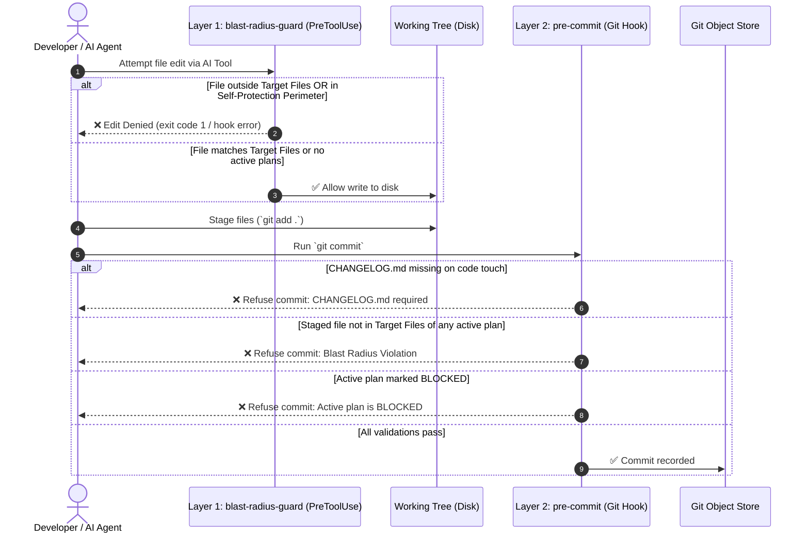

# 📖 Asymmetric Agent Planning Protocol (AAPP) — Technical Manual

> **The comprehensive architecture, operational manual, and technical reference for zero-drift autonomous agent workflows.**

---

## 📑 Table of Contents

* [1. System Architecture & Philosophy](#1-system-architecture--philosophy)
  * [The Problem: Context Pollution and Agent Drift](#the-problem-context-pollution-and-agent-drift)
  * [The Core Primitive: Git Worktrees on Orphan Branches](#the-core-primitive-git-worktrees-on-orphan-branches)
  * [Directory Map and Ownership Model](#directory-map-and-ownership-model)
* [2. Git Plumbing & Worktree Mechanics](#2-git-plumbing--worktree-mechanics)
  * [Under the Hood: Orphan Branches & Worktrees](#under-the-hood-orphan-branches--worktrees)
  * [Remote Synchronization & Multi-Workstation Setup](#remote-synchronization--multi-workstation-setup)
  * [Re-Attaching and Repairing Worktrees](#re-attaching-and-repairing-worktrees)
* [3. Dual-Layer Blast Radius Enforcement Engine](#3-dual-layer-blast-radius-enforcement-engine)
  * [Layer 1: Write-Time PreToolUse Guard (`blast-radius-guard`)](#layer-1-write-time-pretooluse-guard-blast-radius-guard)
  * [Layer 2: Commit-Time Pre-Commit Engine (`pre-commit`)](#layer-2-commit-time-pre-commit-engine-pre-commit)
  * [Parsing Invariants & Prose Isolation](#parsing-invariants--prose-isolation)
  * [Escape Hatches & Fail-Open Design](#escape-hatches--fail-open-design)
* [4. The Two-Lane Protocol: Issues vs. Plans](#4-the-two-lane-protocol-issues-vs-plans)
  * [Strict Lane Separation](#strict-lane-separation)
  * [Issue Promotion Protocol](#issue-promotion-protocol)
  * [Mid-Execution Issue Escape Triage](#mid-execution-issue-escape-triage)
* [5. AAPP State Machine & Lifecycle Commands](#5-aapp-state-machine--lifecycle-commands)
  * [The Lifecycle Pipeline](#the-lifecycle-pipeline)
  * [Command Reference (`/status`, `/digest`, `/freeze`, `/done`, `/release`)](#command-reference)
  * [Token Management & Context Efficiency](#token-management--context-efficiency)
* [6. Agent & IDE Integration Guide](#6-agent--ide-integration-guide)
  * [Google Antigravity Integration](#google-antigravity-integration)
  * [Anthropic Claude Code Integration](#anthropic-claude-code-integration)
  * [Cursor & VS Code Integration](#cursor--vs-code-integration)
  * [GitHub Copilot & Gemini CLI](#github-copilot--gemini-cli)
* [7. Hook Manager Interoperability Recipes](#7-hook-manager-interoperability-recipes)
  * [Native Git Hooks](#native-git-hooks)
  * [Husky](#husky)
  * [Lefthook](#lefthook)
  * [Pre-Commit (Python Framework)](#pre-commit-python-framework)
  * [Subprocess vs. Source Rationale](#subprocess-vs-source-rationale)
* [8. Maintenance, Operations & Troubleshooting FAQ](#8-maintenance-operations--troubleshooting-faq)

---

## 1. System Architecture & Philosophy

### The Problem: Context Pollution and Agent Drift

Modern AI coding assistants (Antigravity, Claude Code, Cursor, Copilot) are exceptionally capable at generating code. However, when pair-programming without deterministic boundaries, three systemic failure modes emerge:

1. **Agent Drift & Scope Creep**: An agent tasked with editing a single module discovers a helper function, decides to "clean up" the codebase, refactors working code, and touches 15 unrelated files without human consent.
2. **Context & History Pollution**: Scratchpad notes, architectural thoughts, planning files, and agent conversation artifacts get committed directly to your `main` branch. This pollutes `git log`, creates merge conflicts across feature branches, and confuses release tooling.
3. **Fragile Invariants**: Prompt instructions alone are probabilistic. An agent instructed "do not touch file X" will eventually touch file X if token context compresses or context shifts.

### The Core Primitive: Git Worktrees on Orphan Branches

AAPP solves this structurally through native Git plumbing: **Git Worktrees mounted on isolated Orphan Branches**.

```text
┌────────────────────────────────────────────────────────────────────────┐
│                        MAIN REPOSITORY TREE                            │
│           (Pure application source code, e.g. src/, tests/)             │
└───────┬──────────────────────────┬───────────────────────────┬─────────┘
        │                          │                           │
        ▼                          ▼                           ▼
┌──────────────────┐      ┌──────────────────┐       ┌───────────────────┐
│     .plans/      │      │     .agents/     │       │    .githooks/     │
│ (Worktree: plans)│      │(Worktree: agents)│       │(Worktree: githooks│
│  Orphan Branch   │      │  Orphan Branch   │       │   Orphan Branch   │
├──────────────────┤      ├──────────────────┤       ├───────────────────┤
│ • current/*.md   │      │ • AGENTS.md      │       │ • pre-commit      │
│ • done/*.md      │      │ • PROJECT.MD     │       │ • blast-radius-   │
│ • pickup.md      │      │ • rules/*.md     │       │   guard           │
│ • issues_road_   │      │                  │       │                   │
│   map.md         │      │                  │       │                   │
│ • state_matrix.md│      │                  │       │                   │
└──────────────────┘      └──────────────────┘       └───────────────────┘
```

By decoupling these concerns into independent Git worktrees:
- Planning notes, task checklists, and architectural matrices **never appear in your application git history**.
- You can switch, rebase, cherry-pick, or reset feature branches in your application code **without losing your active planning scratchpads or agent state**.
- All AI assistants share the exact same ground truth on disk.

### Directory Map and Ownership Model

| Directory / File | Mount Type | Canonical Purpose |
| :--- | :--- | :--- |
| `CODEMAP.md` | Repo Root | Canonical directory ownership, module boundaries, and entrypoints. |
| `ARCHITECTURE.md` | Repo Root | Invariant technical rules, forbidden libraries, and core abstractions. |
| `CHANGELOG.md` | Repo Root | Keep-a-Changelog record of user-facing changes (enforced on code commits). |
| `ISSUES.md` | Repo Root | Canonical record of active and historical defects/bugs. |
| `.plans/` | `plans` worktree | Active blueprints (`current/`), archives (`done/`), scratchpad (`pickup.md`), issue triage roadmap (`issues_road_map.md`), and state matrix (`state_matrix.md`). |
| `.agents/` | `agents` worktree | Agent behavioral contracts (`AGENTS.md`) and project-specific personas (`PROJECT.MD`). |
| `.githooks/` | `githooks` worktree | Dual-layer blast radius enforcement scripts (`pre-commit`, `blast-radius-guard`). |
| `.claude/settings.json` | Repo Root | Configures Claude Code to trigger `.githooks/blast-radius-guard` on `PreToolUse`. |

---

## 2. Git Plumbing & Worktree Mechanics

### Under the Hood: Orphan Branches & Worktrees

An **orphan branch** in Git is a branch that has no parent commits and shares no common history with the main branch. A **worktree** allows a single repository to have multiple working trees attached simultaneously.

When `aapp init` sets up a worktree (for example `.plans`), it executes:

```bash
# 1. Check if the orphan branch already exists locally or remotely
if git rev-parse --verify plans >/dev/null 2>&1; then
    # Local branch exists: add worktree attached to it
    git worktree add .plans plans
elif git rev-parse --verify origin/plans >/dev/null 2>&1; then
    # Remote tracking branch exists: track it
    git worktree add --track -b plans .plans origin/plans
else
    # Create new orphan branch and worktree
    git worktree add --detach .plans
    (
        cd .plans
        git checkout --orphan plans
        git rm -rf . >/dev/null 2>&1 || true
        # Scaffold templates...
        git add -A
        git commit -m "chore: initialize plans worktree"
    )
fi
```

### Remote Synchronization & Multi-Workstation Setup

Because worktrees are attached to regular Git branches, they can be pushed and pulled to any remote (GitHub, GitLab, self-hosted Git server).

#### Pushing Worktrees to Remote

```bash
# Push planning state to remote
git -C .plans push origin plans

# Push agent contracts to remote
git -C .agents push origin agents

# Push githooks engine to remote
git -C .githooks push origin githooks
```

#### Cloning onto a Second Workstation or CI

When cloning a repository for the first time on a new machine:

```bash
git clone git@github.com:your-org/your-repo.git
cd your-repo

# Initialize AAPP — automatically detects remote orphan branches and mounts worktrees
aapp init
```

`aapp init` detects `origin/plans`, `origin/agents`, and `origin/githooks` and mounts tracking worktrees without generating conflict warnings.

### Re-Attaching and Repairing Worktrees

If a worktree directory is accidentally deleted (`rm -rf .plans`), Git may retain internal reference metadata in `.git/worktrees/plans`. To repair:

```bash
# 1. Prune dead worktree metadata
git worktree prune

# 2. Re-add worktree pointing to existing local branch
git worktree add .plans plans
```

---

## 3. Dual-Layer Blast Radius Enforcement Engine

AAPP provides deterministic safety by enforcing boundaries at two distinct moments in the development lifecycle:



---

### Layer 1: Write-Time PreToolUse Guard (`blast-radius-guard`)

Located at `.githooks/blast-radius-guard`, this executable intercepts AI tool calls before disk writes occur (e.g. Claude Code's `PreToolUse` hook).

#### Key Responsibilities:
1. **Self-Protection Perimeter**: AI tools are strictly forbidden from modifying enforcement configuration:
   - `.githooks/*`
   - `.claude/settings.json`
   - `.cursor/rules/*`
2. **Blast Radius Enforcement**: If an active, non-blocked plan exists in `.plans/current/*.md`, any write outside the plan's `### 📂 Target Files` is blocked immediately with a clear error payload.
3. **Zero Dependency JSON Parsing**: Uses standard POSIX tools (`awk`/`sed`/`grep`) to parse hook payloads without requiring `jq` or external binaries.
4. **Fail-Open Resilience**: If no active plan exists, or on malformed input, the guard fails open so developer workflows are never bricked.

---

### Layer 2: Commit-Time Pre-Commit Engine (`pre-commit`)

Located at `.githooks/pre-commit`, this Git hook runs on every `git commit`.

#### Key Responsibilities:
1. **Changelog Enforcement**: Whenever any source code file is modified, `CHANGELOG.md` must be staged. Rules files (`.agents/*`) and planning files (`.plans/*`) are exempt.
2. **Blast Radius Verification**: Compares all staged files against the union of `### 📂 Target Files` across all active blueprints in `.plans/current/*.md`.
3. **Concurrent Plan Support**: If two developers or agents work on separate active plans (`plan-a.md` and `plan-b.md`), files declared in *either* plan are permitted.
4. **Blocked Plan Refusal**: If a plan's status is `🚫 BLOCKED`, commits targeting its files are rejected until the human unblocks the plan.
5. **Syntax Validation**: Automatically runs syntax verification on staged files (e.g., `bash -n`, `python -m py_compile`, `node --check`).

---

### Parsing Invariants & Prose Isolation

To prevent accidental scope widening, AAPP uses strict parsing invariants:

- **First-Backtick Rule**: Only the **first** backticked path on a list line in `### 📂 Target Files` is treated as a target path.
  ```markdown
  ### 📂 Target Files
  - [ ] `src/Auth/TokenManager.php` -> Refactor token rotation; see `src/Database/Connection.php` for reference.
  ```
  *Result*: Only `src/Auth/TokenManager.php` is in scope. `src/Database/Connection.php` is treated purely as prose.
- **Directory Prefix Matching**: If a target ends in `/` (e.g. `- [ ] `src/Billing/``), all files within that directory subtree are permitted.
- **Spaces in Filenames**: Correctly parses and matches filepaths containing spaces or special characters.

---

### Escape Hatches & Fail-Open Design

AAPP is designed to assist developers, not trap them.

- **Commit-Time Escape Hatch**:
  ```bash
  SKIP_BLAST_RADIUS=1 git commit -m "emergency: hotfix bypass"
  ```
  Setting `SKIP_BLAST_RADIUS=1` bypasses both CHANGELOG and Blast Radius validation.
- **No-Plan Grace Period**: If `.plans/current/` has no markdown files (or only templates/placeholders), the pre-commit hook logs a notice and allows all commits.

---

## 4. The Two-Lane Protocol: Issues vs. Plans

AAPP enforces a strict conceptual separation between **fixing what exists** and **building what does not exist**.

```
                           ┌───────────────────────────┐
                           │      RAW IDEA / INPUT     │
                           └─────────────┬─────────────┘
                                         │
                   Does it describe broken/wrong behavior
                         in existing shipped code?
                                ╱            ╲
                             YES              NO
                             ╱                  ╲
                            ▼                    ▼
               ┌───────────────────────┐   ┌───────────────────────────┐
               │      ISSUE LANE       │   │         PLAN LANE         │
               │  Record in ISSUES.md  │   │  Draft in .plans/current  │
               │  Order on roadmap.md  │   │  Track on state_matrix.md │
               └───────────┬───────────┘   └─────────────┬─────────────┘
                           │                             │
                     Is fix large,                       │
                  multi-module, or RFC?                  │
                         ╱       ╲                       │
                      YES         NO                     │
                      ╱             ╲                    │
                     ▼               ▼                   ▼
            ┌─────────────────┐ ┌─────────┐   ┌────────────────────────┐
            │   PROMOTION     │ │ Direct  │   │  Incubator -> Freeze   │
            │ Draft Blueprint │ │  Patch  │   │     -> Execution       │
            └────────┬────────┘ └─────────┘   └────────────────────────┘
                     │                                   │
                     └───────────────────────────────────┘
```

### Strict Lane Separation

| Property | **Issue Lane** (Bugs & Gaps) | **Plan Lane** (Implementations) |
| :--- | :--- | :--- |
| **Describes** | Something that exists and behaves wrongly | Something that does not exist yet |
| **Canonical Record** | `ISSUES.md` (repo root) | `.plans/current/<plan>.md` |
| **Priority Ordering** | `.plans/issues_road_map.md` | `.plans/state_matrix.md` |
| **Contents** | Bugs, regressions, edge-case gaps | Features, refactors, new capabilities |
| **Blast Radius?** | No — fixed in place | Yes — locked before execution |

---

### Issue Promotion Protocol

When a bug requires architectural decisions, spans multiple modules, or requires a locked Blast Radius, it is promoted to a plan:

1. **Keep `ISSUES.md` intact**: The issue is never deleted; it remains the record of *what is wrong*.
2. **Draft Blueprint**: Run `/digest ISSUE-00X` to scaffold a blueprint from `.plans/plan-template.md`.
3. **Link Records**:
   - Set `**Target Issue / Milestone:** ISSUE-00X` in the plan.
   - Add the blueprint link to the issue's row in `ISSUES.md`.
4. **Update Status**: Mark the issue as 🔵 `Planned` in `issues_road_map.md`.
5. **Register Plan**: Add the plan to `.plans/state_matrix.md` in the Incubator.
6. **Close upon Archive**: Close the issue only when the plan is implemented, verified, and archived via `/done`.

---

### Mid-Execution Issue Escape Triage

If an agent discovers an unexpected bug while executing a frozen plan:

1. **Always Record**: Add the bug to `ISSUES.md` immediately.
2. **Evaluate Triage Path**:
   - **Path A: Non-Blocking Bug**: Continue the assigned plan. Do not touch the bug. Append to `issues_road_map.md`.
   - **Path B: Blocking & Small**: Expand the active plan's Blast Radius under an `### 🚨 Emergency Hotfix Extensions` subsection with justification, fix the blocker, and resume.
   - **Path C: Blocking & Substantial**:
     - **STOP execution immediately.**
     - Mark the active plan's status as `🚫 BLOCKED` (`**Blocked On:** ISSUE-00X`).
     - Move the plan to `## 🚫 Blocked` in `state_matrix.md`. (The pre-commit hook will reject any further commits).
     - Present open questions to the human and wait for unblocking.

---

## 5. AAPP State Machine & Lifecycle Commands

### The Lifecycle Pipeline

```
  ┌────────────┐        ┌─────────────┐        ┌──────────────┐        ┌───────────┐
  │  Idea /    │ /digest│  Incubator  │ /freeze│  Greenlight  │ /done  │  Archive  │
  │  pickup.md ├───────►│ 🔴 Draft    ├───────►│  🟢 Ready    ├───────►│  .plans/  │
  │            │        │ 🟡 Refined  │        │  (Execution) │        │  done/    │
  └────────────┘        └─────────────┘        └──────────────┘        └───────────┘
```

---

### Command Reference

#### `/status` — Context Recovery
Executed when returning to a project or starting a session. Reports across the **Four Pillars**:
1. **Shipped**: Recent entries in `CHANGELOG.md` (`## [Unreleased]`).
2. **Issues**: Top open issues from `ISSUES.md` and `.plans/issues_road_map.md`.
3. **Plans**: Active incubator plans and greenlit tasks in `.plans/state_matrix.md`.
4. **Pickup**: Unprocessed ideas in `.plans/pickup.md` with count.

#### `/digest <idea>` — Targeted Idea Ingestion
Ingests a single idea from `pickup.md` or raw text:
- Routes to Issue Lane (`ISSUES.md`) or Plan Lane (`.plans/current/`).
- Decides whether to **NEW** (scaffold fresh plan) or **AMEND** (fold into existing plan).
- Cross-references `CODEMAP.md` and `ARCHITECTURE.md`.
- Formulates `Open Questions` and leaves status in the Incubator (`🔴 Draft`).

#### `/freeze <plan>` — Boundary Lock & Greenlight
Transitions a refined blueprint into the Greenlight Zone:
- Verifies all Open Questions are answered.
- Validates explicit `### 📂 Target Files` and `### 🛑 Out of Bounds`.
- Changes status to `🟢 Ready for Execution`.
- Enables commit-time and write-time enforcement for the plan's targets.

#### `/done <plan>` — Archival Ledger
Completes the lifecycle:
- Moves blueprint: `mv .plans/current/<plan>.md .plans/done/<plan>.md`.
- Updates `.plans/state_matrix.md` to `100% DONE` in the Archival Ledger.
- Prompts for `CHANGELOG.md` verification.

#### `/release <version>` or `/preflight` — Release Runbook
Executes `.plans/release/release_checklist.md`:
- Runs full test suites, static analysis, and security checks.
- Validates `CHANGELOG.md` release staging.
- Reports release posture assessment to the developer.

---

### Token Management & Context Efficiency

To optimize LLM context windows and reduce token costs:
- **Focus strictly on active sections**: When reading `.plans/state_matrix.md`, ignore collapsed `<details>` blocks containing historical milestones.
- **Archive Isolation**: Files in `.plans/done/` and `.plans/aborted/` are historical archives; agents should not load them unless specifically requested for historical auditing.

---

## 6. Agent & IDE Integration Guide

### Google Antigravity Integration

Antigravity natively discovers workspace rules and skills.

1. **Workspace Rules**: AAPP rules in `.agents/AGENTS.md` and `.agents/PROJECT.MD` are automatically indexed.
2. **Planning Mode Alignment**: Antigravity's internal planning mode seamlessly maps to `.plans/current/*.md` blueprints and `/freeze` workflows.

---

### Anthropic Claude Code Integration

AAPP integrates with Claude Code's tool execution lifecycle:

1. **Hook Configuration (`.claude/settings.json`)**:
   ```json
   {
     "hooks": {
       "PreToolUse": [
         {
           "matcher": "Edit|Write|MultiEdit",
           "command": "\"$CLAUDE_PROJECT_DIR/.githooks/blast-radius-guard\""
         }
       ]
     }
   }
   ```
2. **Interception**: Claude Code passes JSON payloads to `.githooks/blast-radius-guard`. If a tool targets a file outside `### 📂 Target Files`, the tool execution is aborted with a structured failure message.

---

### Cursor & VS Code Integration

1. **Multi-Root Workspaces**: `.plans/`, `.agents/`, and `.githooks/` appear as standard workspace directories in the VS Code sidebar.
2. **Cursor Rules**: Symlink or mirror `.agents/AGENTS.md` to `.cursor/rules/aapp.mdc` or `.cursorrules`.

---

### GitHub Copilot & Gemini CLI

Add a workspace instruction pointing to `.agents/AGENTS.md` so Copilot and Gemini CLI adhere to the Two Lanes rule, Changelog enforcement, and attribution trailers.

---

## 7. Hook Manager Interoperability Recipes

If your project already uses a hook manager, `aapp init` leaves your configuration untouched and provides a non-destructive subprocess wiring snippet.

### Subprocess vs. Source Rationale

> [!IMPORTANT]
> **Always wire hooks as a subprocess (`"path/to/hook" || exit 1`) rather than `source` or `exec`.**
> 
> - `source .githooks/pre-commit`: Shares shell variables and environment, meaning an internal `exit 0` in the child hook will terminate the parent hook immediately, skipping your remaining linters.
> - `exec .githooks/pre-commit`: Replaces the current process image entirely, preventing any subsequent commands from running.
> - **`".../.githooks/pre-commit" || exit 1`**: Runs in an isolated subprocess. Exit code `0` continues execution; exit code `1` aborts the commit cleanly.

---

### Native Git Hooks

File: `.git/hooks/pre-commit`

```sh
#!/usr/bin/env bash
set -e

# Run existing linter/test checks
npm test

# Run AAPP Blast Radius & Changelog Enforcement
"$(git rev-parse --show-toplevel)/.githooks/pre-commit" || exit 1
```

---

### Husky

File: `.husky/pre-commit`

```sh
#!/usr/bin/env sh
. "$(dirname -- "$0")/_/husky.sh"

# Run project linting
npm run lint-staged

# Run AAPP Blast Radius Engine
"$(git rev-parse --show-toplevel)/.githooks/pre-commit" || exit 1
```

---

### Lefthook

File: `lefthook.yml`

```yaml
pre-commit:
  commands:
    aapp-blast-radius:
      run: "$(git rev-parse --show-toplevel)/.githooks/pre-commit"
```

---

### Pre-Commit (Python Framework)

File: `.pre-commit-config.yaml`

```yaml
repos:
  - repo: local
    hooks:
      - id: aapp-blast-radius
        name: AAPP Blast Radius Engine
        entry: .githooks/pre-commit
        language: script
        pass_filenames: false
```

---

## 8. Maintenance, Operations & Troubleshooting FAQ

### Q: How do I upgrade an existing project to a newer AAPP version?
Upgrading is completely zero-parameter. In your project root, run:
```bash
aapp init
```
(Or drop-in `./aapp-kit/aapp init`).
`aapp init` automatically:
1. Swaps the delimited protocol block in `.agents/AGENTS.md` (`<!-- AAPP-PROTOCOL:START ... -->` to `<!-- AAPP-PROTOCOL:END -->`) while leaving all your custom project rules above and below 100% untouched.
2. Updates `.githooks/pre-commit` and `.githooks/blast-radius-guard` to the latest engine.
3. Merges any missing Claude Code hooks into `.claude/settings.json` non-destructively.
4. In drop-in mode, automatically consumes the temporary clone directory upon success.

---

### Q: How do I update globally installed AAPP tools?
```bash
aapp upgrade
```
This shallow-clones the latest release from upstream and refreshes `$HOME/.local/bin/aapp` and `${XDG_DATA_HOME:-$HOME/.local/share}/aapp-kit/`.

---

### Q: How do I completely uninstall globally installed AAPP binaries?
```bash
aapp uninstall
```
This removes `aapp` from `$HOME/.local/bin/` and deletes `${XDG_DATA_HOME:-$HOME/.local/share}/aapp-kit/`, leaving your project worktrees and shell configuration intact.

---

### Q: What if an agent gets trapped in a refusal loop?
If an agent repeatedly attempts to write to an undeclared file:
1. Stop the agent.
2. Check if the file should genuinely be part of the task.
3. If yes, add the file to `### 📂 Target Files` in `.plans/current/<plan>.md`.
4. If no, instruct the agent to achieve the goal using only declared targets.

---

### Q: How do I handle merge conflicts in `.plans/` or `.agents/`?
Because worktrees operate on separate branches, you resolve conflicts using standard Git commands inside the worktree directory:
```bash
cd .plans
git pull origin plans
# Resolve any conflict markers in pickup.md or state_matrix.md
git add -A
git commit -m "chore: resolve planning merge conflicts"
git push origin plans
```
Your main application working tree remains completely unaffected.

---

### Q: Can I use AAPP in repositories without AI agents?
**Yes.** AAPP's Two-Lane protocol, Changelog enforcement, and isolated planning worktrees provide immense value for human teams seeking clean git histories and structured RFC processes.
