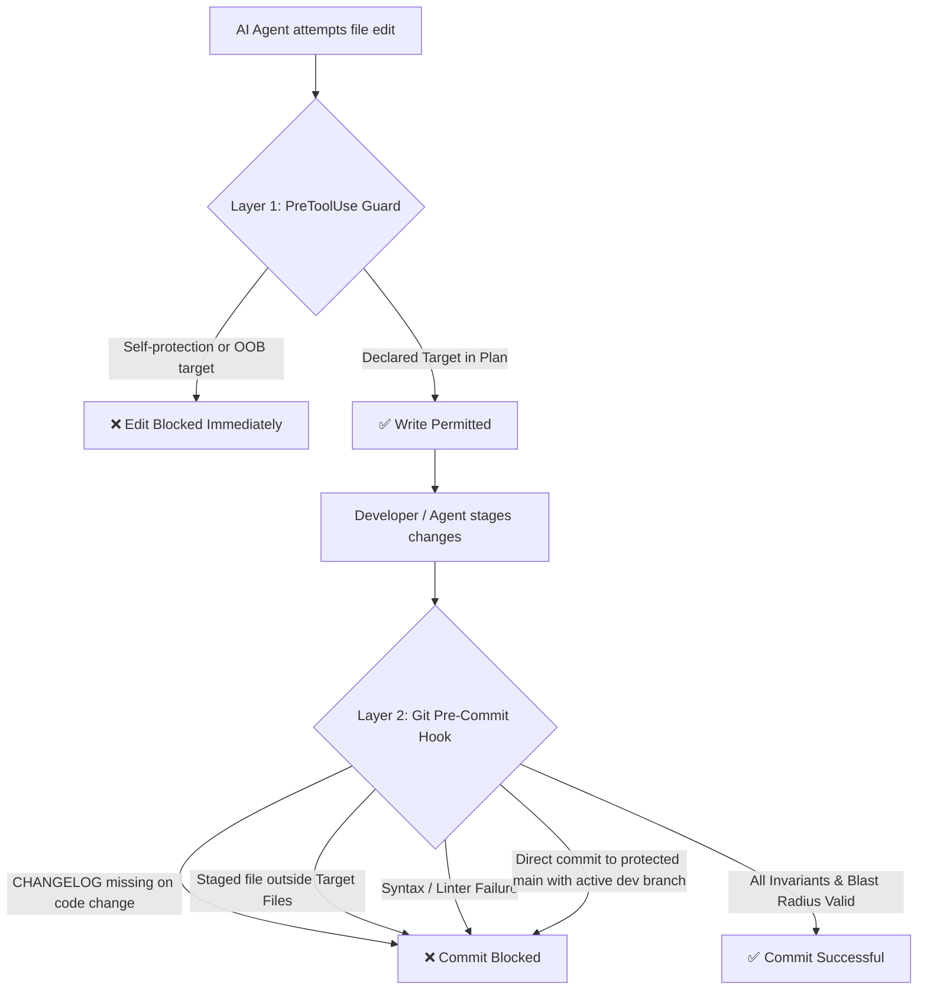

# 🤖 Asymmetric Agent Planning Protocol (AAPP)

> **Zero-Drift Autonomous Pair-Programming Architecture for Antigravity, Claude Code, Cursor, Copilot & AI Coding Agents.**  
> Completely decouples planning, agent rules, and git enforcement from your application source code using isolated Git worktrees mounted on orphan branches.
>
> 📚 **Deep Dive**: For the full architecture, Git plumbing, and operational guide, see [MANUAL.md](MANUAL.md).

---

## 📑 Table of Contents

* [1. Why AAPP? The Problem of Agent Drift](#1-why-aapp-the-problem-of-agent-drift)
* [2. The Core Architecture](#2-the-core-architecture)
* [3. Dual-Layer Blast Radius Enforcement](#3-dual-layer-blast-radius-enforcement)
* [4. Quick Start & Distribution Modes](#4-quick-start--distribution-modes)
  * [Option 1: Drop-In Project Setup (Self-Consuming)](#option-1-drop-in-project-setup-self-consuming)
  * [Option 2: Global Installation](#option-2-global-installation)
  * [Option 3: Contributor / Development Setup (aapp develop)](#option-3-contributor--development-setup-aapp-develop)
* [5. Branching Topologies & Adaptive Branch Protection](#5-branching-topologies--adaptive-branch-protection)
  * [Option A: Trunk-Based Development (Single Branch)](#option-a-trunk-based-development-single-branch)
  * [Option B: Dual-Branch Topology (Stable vs. Edge — Recommended)](#option-b-dual-branch-topology-stable-vs-edge--recommended)
  * [🛡️ Smart Adaptive Branch Protection](#-smart-adaptive-branch-protection)
* [6. Existing Project Conflicts, Adoption & Upgrades](#6-existing-project-conflicts-adoption--upgrades)
  * [Seamless Adoption & In-Place Protocol Upgrades](#seamless-adoption--in-place-protocol-upgrades)
  * [Existing Hook Managers (Husky, Lefthook, Native Hooks)](#existing-hook-managers-husky-lefthook-native-hooks)
* [7. Remote Sync & Multi-Machine Workflow](#7-remote-sync--multi-machine-workflow)
* [8. Daily Agent Workflow & Slash Commands](#8-daily-agent-workflow--slash-commands)
* [9. Testing & Verification Suites](#9-testing--verification-suites)
* [10. Blueprint Example & Technical Manual](#10-blueprint-example--technical-manual)
* [11. License](#11-license)

---

## 1. Why AAPP? The Problem of Agent Drift

Working with AI coding assistants through unconstrained flat chat creates **agent drift**:
* **Scope Creep**: The agent modifies unrelated files, rewrites existing helpers, or refactors working logic without permission.
* **Context Hallucination**: AI instructions, scratchpads, and planning state pollute your main code commits and git history, causing merge conflicts.
* **Lack of Invariants**: Changes bypass project boundaries, security perimeters, and documentation requirements.

### 🎯 The Solution: Deterministic Blast Radius
A frozen blueprint with a declared **Blast Radius** converts agent execution from probabilistic guesswork into a **deterministic structure**: the agent executes within the developer's exact architectural shape, and any file modifications outside declared boundaries are refused at both write-time and commit-time.

---

## 2. The Core Architecture

AAPP isolates planning, behavioral rules, and enforcement into **three Git worktrees mounted on independent orphan branches**:

```text
your-project/ (main/dev branch - contains application source code & public docs)
├── README.md            --> Public project overview & quickstart
├── CHANGELOG.md         --> Public release notes (default root; .plans/ supported)
├── ARCHITECTURE.md      --> Public system architecture & design invariants (or in .agents/)
├── .plans/              --> Worktree mounted on orphan branch 'plans'
│   ├── current/         --> Active RFC blueprints & plans (e.g. plan-auth.md)
│   ├── release/         --> Production checklists & release runbooks
│   ├── done/            --> Historical archives (000-archive-ledger.md & 000-issues-archive.md)
│   ├── aborted/         --> Discarded plans
│   ├── pickup.md        --> Fast agent scratchpad for active context
│   ├── ISSUES.md        --> Active flat technical backlog & defect ledger (Relocation Invariant)
│   ├── issues_road_map.md --> Defect priority board with ⭐ User Priority (auto-pruned by hook)
│   └── state_matrix.md  --> State matrix & active incubator brain
├── .agents/             --> Worktree mounted on orphan branch 'agents'
│   ├── AGENTS.md        --> Agent behavioral contracts & slash commands
│   ├── CODEMAP.md       --> Module ownership & structural interface mapping
│   └── PROJECT.MD       --> Master architectural specification & rules
├── .githooks/           --> Worktree mounted on orphan branch 'githooks'
│   ├── pre-commit       --> Master runner (dispatches checks, project-owned)
│   ├── aapp-pre-commit  --> Deterministic commit-time blast radius engine (managed by AAPP)
│   └── blast-radius-guard --> PreToolUse write-time guard for AI agents
└── .claude/
    └── settings.json    --> Wires write-time guard to Claude Code
```

### 💎 Key Architectural Benefits
1. **Zero Git History Pollution**: Your `main` branch contains only pure application code and public-facing documentation. Planning notes, RFCs, and prompt modifications never appear in application commit logs.
2. **Branch Independent**: Switch, rebase, or merge application feature branches without losing your active planning scratchpads or agent state.
3. **Multi-Agent Interoperability**: Antigravity, Claude Code, Cursor, Copilot, Gemini CLI, and human developers all share the same state and contracts.
4. **Dual-Location Flexibility**: Public-facing files (`CHANGELOG.md`, `ARCHITECTURE.md`) can live at the repository root or be fully decoupled into worktrees according to your project's preference.

---

## 3. Dual-Layer Blast Radius Enforcement

AAPP enforces safety across two complementary layers:



1. **Layer 1: Write-Time Hook (`.githooks/blast-radius-guard`)**
   - Intercepts AI tool executions (e.g. Claude Code `PreToolUse` events).
   - Prevents AI from tampering with enforcement hooks (`.githooks/*`, `.claude/settings.json`, `.cursor/rules/*`).
   - Rejects file modifications outside the active blueprint's declared `### 📂 Target Files`.
   - **Fail-Open Safety**: Never bricks the developer when no active blueprints exist or on invalid inputs.

2. **Layer 2: Commit-Time Hook (`.githooks/aapp-pre-commit` / `.githooks/pre-commit`)**
   - Enforces `CHANGELOG.md` updates whenever core code changes.
   - Validates staged files against the active plan in `.plans/current/*.md`.
   - Supports concurrent active plans without cross-blocking.
   - Performs syntax checking on modified files.
   - **Adaptive Branch Protection**: Prevents accidental direct commits to `main` when active development branches exist.
   - **Roadmap Hygiene**: Automatically prunes resolved issues (`✅` or `Resolved`) from `issues_road_map.md` (<5ms), keeping the priority queue active-only.
   - Escape hatches available when needed: `SKIP_BLAST_RADIUS=1` or `ALLOW_MAIN_COMMIT=1`.

---

## 4. Quick Start & Distribution Modes

You can adopt AAPP in two ways: as a **self-consuming drop-in folder** for a single project, or as a **global installation** for reuse across all your repositories.

### Option 1: Drop-In Project Setup (Self-Consuming)
Ideal for single projects. Clones a self-contained folder directly into your project root:

```bash
cd /path/to/my-project

# 1. Clone into aapp-kit folder
git clone https://github.com/aapp-protocol/aapp-kit.git aapp-kit

# 2. Run initialization
./aapp-kit/aapp init
```

* **What it does:** Sets up `.plans/`, `.agents/`, and `.githooks/` worktrees, creates documentation anchors, wires hooks, and **consumes the `aapp-kit/` directory upon success**.
* **Clean & Reversible:** Right up until you run `aapp init`, you can cancel adoption with `rm -rf aapp-kit`.
* **Source retention:** If you want to keep the kit source checkout, copy the folder before running `aapp init`.

### Option 2: Global Installation
Ideal for developers managing multiple projects:

```bash
# 1. Clone kit
git clone https://github.com/aapp-protocol/aapp-kit.git aapp-kit

# 2. Run global installer
./aapp-kit/aapp install
```

* **What it does:** Installs `aapp` into `$HOME/.local/bin/` and copies libraries/templates/tests to `${XDG_DATA_HOME:-$HOME/.local/share}/aapp-kit/`. Consumes the temporary clone folder once installed.
* **Usage in any project:**
  ```bash
  cd /path/to/any-project
  aapp init
  ```
* **Context Recovery Briefing:**
  ```bash
  aapp status
  ```
* **Updating Global Tools:**
  ```bash
  aapp upgrade
  ```
* **Uninstallation:**
  ```bash
  aapp uninstall
  ```
  Removes AAPP binary and share files while leaving shared directories and shell rc PATH configuration completely intact.

### Option 3: Contributor / Development Setup (`aapp develop`)
Ideal for core developers and contributors actively working on AAPP itself:

```bash
# 1. Clone kit to aapp-develop-kit
git clone https://github.com/aapp-protocol/aapp-kit.git aapp-develop-kit
cd aapp-develop-kit

# 2. Link repository globally for live development
./aapp develop
```

* **What it does:** Symlinks `~/.local/bin/aapp` and `~/.local/share/aapp-kit` directly to your local clone. All local edits to templates and libraries are **instantly live globally** across your machine without re-copying files or self-consuming.

---

## 5. Branching Topologies & Adaptive Branch Protection

AAPP adapts seamlessly to how your team works, whether you prefer simple trunk-based development or a production-grade dual-branch model.

### Option A: Trunk-Based Development (Single Branch)
If your repository works directly on `main` (or `master`):
- All application commits occur on `main`.
- Planning (`.plans/`), rules (`.agents/`), and hooks (`.githooks/`) remain completely isolated on their orphan branches.
- **Zero friction**: The pre-commit hook automatically detects that no development branch exists, permitting direct commits to `main` without extra configuration.

### Option B: Dual-Branch Topology (Stable vs. Edge — Recommended)
To prevent unreleased features or experimental agent code from landing in production, adopt the **2-Rule Law**:
1. **Branch Law**:
   - `main` is strictly **STABLE** (contains only tagged releases, clean tags e.g. `v1.0.0`).
   - `develop` (or `dev`) is **EDGE** (active day-to-day engineering and feature incubation).
2. **Release Law**:
   - Development happens on `develop`.
   - Releases fast-forward cleanly into `main` before tagging:
     ```bash
     git checkout main
     git merge develop --ff-only
     git tag -a v1.0.1 -m "Release v1.0.1"
     ```

### 🛡️ Smart Adaptive Branch Protection
When a development branch (`develop`, `dev`, or `development`) exists, `.githooks/aapp-pre-commit` automatically activates branch protection:
- **Direct commits to protected branches (`main`, `master`, `production`) are refused** with clear guidance directing you to switch to your development branch.
- **Emergency Release/Hotfix Bypass**: If you intentionally need to commit directly to `main`:
  ```bash
  ALLOW_MAIN_COMMIT=1 git commit -m "hotfix: critical security patch"
  ```
- **Custom Branch Names**: If your team uses custom branch names (e.g. `staging` for development):
  ```bash
  git config aapp.devBranch "staging"
  git config aapp.protectedBranches "main production"
  ```
- **Opting Out**: To permanently disable branch protection for trunk-based development:
  ```bash
  git config --bool aapp.protectStable false
  ```

---

## 6. Existing Project Conflicts, Adoption & Upgrades

### Seamless Adoption & In-Place Protocol Upgrades
When `aapp init` runs against a project:
* **Deterministic Delimited Block Sync:** `aapp init` isolates the core protocol rules between `<!-- AAPP-PROTOCOL:START v1.0.0 -->` and `<!-- AAPP-PROTOCOL:END -->`.
  - **Adoption:** If your existing `.agents/AGENTS.md` does not have markers, the AAPP protocol block is cleanly appended, preserving all your custom rules above it.
  - **In-Place Upgrades:** If markers are present, running `aapp init` updates only the delimited protocol block to the latest version, preserving all custom rules above and below it.
  - **Legacy Flat Migration:** If a legacy `AGENTS.md` exists at the project root, it is automatically migrated into the `.agents/` worktree.
* **Core Infrastructure Sync:** `.githooks/aapp-pre-commit` and `.githooks/blast-radius-guard` are deterministically updated to the latest version and made executable, while `.githooks/pre-commit` is guarded.
* **Non-Destructive `.claude/settings.json` Merge:** Existing Claude Code settings and custom hooks are preserved, and the `PreToolUse` blast-radius guard is merged safely.
* **Automatic Consumption:** In drop-in mode, `aapp init` automatically consumes the temporary `aapp-kit/` directory upon success.

### Existing Hook Managers (Husky, Lefthook, Native Hooks)
If your repository already uses a hook manager (`core.hooksPath` set to `.husky` or `.lefthook`) or has an executable `.git/hooks/pre-commit`:
* `aapp init` **will never overwrite your Git hook configuration**.
* It installs the AAPP hooks into `.githooks/` and prints the non-destructive subprocess wiring line:

```sh
"$(git rev-parse --show-toplevel)/.githooks/aapp-pre-commit" || exit 1
```

> [!TIP]
> **Subprocess Execution**: Paste this line into your existing hook script. Executing as a subprocess preserves exit codes and ensures `SKIP_BLAST_RADIUS=1` propagates cleanly without prematurely terminating your caller hook.

---

## 7. Remote Sync & Multi-Machine Workflow

AAPP worktrees exist on separate orphan branches (`plans`, `agents`, `githooks`). You can push and pull them to your remote repository independently:

### Pushing Planning & Agent State
```bash
# Push planning worktree to remote
git -C .plans push origin plans

# Push agent contracts to remote
git -C .agents push origin agents

# Push githooks engine to remote
git -C .githooks push origin githooks
```

### Restoring on a New Machine / CI
When cloning your repository onto a second workstation:
```bash
git clone <your-repo-url> my-project
cd my-project

# Initialize and mount existing remote orphan branches
aapp init
```
`aapp init` automatically detects `origin/plans`, `origin/agents`, and `origin/githooks` and mounts tracking worktrees without conflict warnings.

---

## 8. Daily Agent Workflow & Universal Skills

AAPP ships core lifecycle verbs as **Universal AAPP Skills** (`skills/<name>/SKILL.md`) natively stored in the orphan `agents` worktree (`.agents/skills/`) and bridged to Claude Code (`.claude/skills/`).

### Cross-Agent Progressive Disclosure & Compatibility
* **Universal Discovery**: Skills follow the standard depth-1 invariant (`skills/*/SKILL.md`), enabling out-of-the-box discovery in **Google Antigravity**, **Anthropic Claude Code**, **Cursor**, and **OpenAI Codex**.
* **Progressive Disclosure**: Agents only index lightweight names and descriptions (~100 tokens), loading full execution procedures on-demand when triggered.
* **Execution Models**: Long-running preflight checks (`/aapp-release`) run in an isolated subagent fork (`context: fork`), while conversational workflows (`/aapp-digest`, `/aapp-status`) run inline to preserve active conversation context.

| Slash Command | Natural Alias | Lifecycle Phase | Description |
| :--- | :--- | :--- | :--- |
| `/aapp-status` | `status`, `/status`, `/aapp status` | **Orient** | Scan four pillars (Shipped, Issues, Plans, Pickup) to report current posture. |
| `/aapp-digest <idea>` | `digest <idea>`, `/digest` | **Ingest** | Ingest idea into Issue Lane (`ISSUES.md`) or Plan Lane (`.plans/current/`). |
| `/aapp-freeze <plan>` | `freeze <plan>`, `/freeze` | **Lock** | Lock Blast Radius boundaries and greenlight blueprint for execution. |
| `/aapp-done <plan>` | `done <plan>`, `/done` | **Archive** | Move plan to `done/`, append to `000-archive-ledger.md`, and clean `state_matrix.md`. |
| `/aapp-release <ver>` | `release <ver>`, `/preflight` | **Preflight** | Execute release verification runbook and check changelog staging. |

### Blueprint Anatomy (Blast Radius Declaration)
Every plan in `.plans/current/<name>.md` defines strict boundaries:

```markdown
# 🗺️ Plan: Authentication Refactor
* **Status:** 🟢 Ready for Execution

## 💥 3. Blast Radius & System Boundaries

### 📂 Target Files (Modifications & Additions)
- [ ] `src/Auth/TokenManager.php` -> Token rotation logic
- [ ] NEW FILE -> `src/Auth/SessionGuard.php` -> New session validator
- [ ] `schema/auth.json` -> Schema updates

### 🛑 Out of Bounds (Do Not Touch)
- [ ] `src/Database/Connection.php` -> Core connection pool is frozen
- [ ] `src/Billing/` -> Financial transactions are out of scope
```

---

## 9. Testing & Verification Suites

AAPP includes 132 automated regression test cases verifying hook enforcement, write-guard protection, branch protection, skill synchronization, flat issue ledger, Plan ID shorthand resolution, five-pair planning-health validation, and installer resolution:

```bash
# Run complete test verification suite (132 tests)
./tests/install_test.sh && ./tests/pre-commit_test.sh && ./tests/write-guard_test.sh && ./tests/plan_resolver_test.sh
```

| Suite | File | Tests | Coverage |
| :--- | :--- | :--- | :--- |
| **CLI & Upgrades** | [tests/install_test.sh](tests/install_test.sh) | 47 cases | Drop-in / global resolution, verbs (`init`, `install`, `upgrade`, `uninstall`, `status`, `develop`), self-consumption protection, in-place block upgrades, migration, `.claude/settings.json` decoupling & merge, Universal Skills sync, drift control, archive provisioning, non-destructive custom `ISSUES.md` advisory, flat schema, Plan ID template headers. |
| **Commit-Time Guard** | [tests/pre-commit_test.sh](tests/pre-commit_test.sh) | 32 cases | Spaces in filenames, concurrent plan isolation, prose backtick isolation, BLOCKED plan refusal regex, pure POSIX JSON parser, non-executable hook execution, adaptive branch protection, POSIX ID-anchored roadmap auto-pruning, detect-and-block Relocation Invariant, planning-health Pairs 1–5 integrity validation. |
| **Write-Time Guard** | [tests/write-guard_test.sh](tests/write-guard_test.sh) | 34 cases | PreToolUse Claude Code JSON payload, self-protection invariants (`.agents/claude/*`, `.claude/settings.json`, `.agents/skills/aapp-*`, `.claude/skills/aapp-*`), fail-open behavior, OOB denial, pure POSIX json parser fallback, large ARG_MAX payload streaming. |
| **Plan Resolver & Health** | [tests/plan_resolver_test.sh](tests/plan_resolver_test.sh) | 19 cases | Plan ID resolution (`P-9`, `9`, `P13`), slug matching, Issue `#` collision rejection, transition verb empty-query guards, `get_plan_id`/`get_next_plan_id`, Pair 4 Plan ID uniqueness, Pair 5 Section 2 target blocks. |

---

## 10. Blueprint Example & Technical Manual
 
* **Complete Blueprint Example**: See [examples/example-plan-distribution-rework.md](examples/example-plan-distribution-rework.md) for a real-world, fully refined AAPP blueprint demonstrating Blast Radius declarations, technical decision logs (Q1–Q9), and verification matrix.
* **Comprehensive Technical Manual**: See [MANUAL.md](MANUAL.md) for low-level Git worktree plumbing, Two Lanes protocol, state machine lifecycle, multi-agent IDE integration, hook manager recipes, and operations.

---

## 11. License

Released under the [BSD 3-Clause License](LICENSE).
