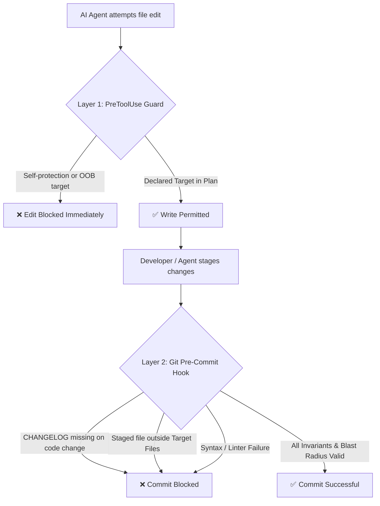

# 🤖 Asymmetric Agent Planning Protocol (AAPP)

> **Zero-Drift Autonomous Pair-Programming Architecture for Antigravity, Claude Code, Cursor, Copilot & AI Coding Agents.**  
> Completely decouples planning, agent rules, and git enforcement from your application source code using isolated Git worktrees mounted on orphan branches.
>
> 📚 **Deep Dive**: For the full architecture, Git plumbing, and operational guide, see [MANUAL.md](MANUAL.md).

---

## 📑 Table of Contents

* [1. Why AAPP? The Problem of Agent Drift](#1-why-aapp-the-problem-of-agent-drift)
* [2. The Core Architecture](#2-the-core-architecture)
* [3. Dual-Layer Blast Radius Enforcement](#3-dual-layer-blast-radius-enforcement)
* [4. Quick Start & Distribution Modes](#4-quick-start--distribution-modes)
  * [Option 1: Drop-In Project Setup (Self-Consuming)](#option-1-drop-in-project-setup-self-consuming)
  * [Option 2: Global Installation](#option-2-global-installation)
* [5. Existing Project Conflicts & Hook Interoperability](#5-existing-project-conflicts--hook-interoperability)
  * [Conflict Handling & Silent-Skipping Warnings](#conflict-handling--silent-skipping-warnings)
  * [Existing Hook Managers (Husky, Lefthook, Native Hooks)](#existing-hook-managers-husky-lefthook-native-hooks)
* [6. Remote Sync & Multi-Machine Workflow](#6-remote-sync--multi-machine-workflow)
* [7. Daily Agent Workflow & Slash Commands](#7-daily-agent-workflow--slash-commands)
* [8. Testing & Verification Suites](#8-testing--verification-suites)
* [9. Blueprint Example & Technical Manual](#9-blueprint-example--technical-manual)
* [10. License](#10-license)

---

## 1. Why AAPP? The Problem of Agent Drift

Working with AI coding assistants through unconstrained flat chat creates **agent drift**:
* **Scope Creep**: The agent modifies unrelated files, rewrites existing helpers, or refactors working logic without permission.
* **Context Hallucination**: AI instructions, scratchpads, and planning state pollute your main code commits and git history, causing merge conflicts.
* **Lack of Invariants**: Changes bypass project boundaries, security perimeters, and documentation requirements.

### 🔍 Real-World Evidence
This repository stands as evidence of the exact problem AAPP solves: in unconstrained development, agents modify files outside their scope, invent unrequested abstractions, and silently bypass unstated assumptions. Every defect was caught only because a human developer pushed back.

A frozen blueprint with a declared **Blast Radius** converts that from *luck* into *deterministic structure*: the agent executes the developer's exact architectural shape, and anything outside it is refused at write-time and commit-time.

---

## 2. The Core Architecture

AAPP isolates planning, behavioral rules, and enforcement into **three Git worktrees mounted on independent orphan branches**:

```text
your-project/ (main/dev branch - contains only pure application source code)
├── .plans/              --> Worktree mounted on orphan branch 'plans'
│   ├── current/         --> Active RFC blueprints & plans (e.g. plan-auth.md)
│   ├── release/         --> Production checklists & release runbooks
│   ├── done/            --> Permanent historical record of finished plans
│   ├── aborted/         --> Discarded plans
│   ├── pickup.md        --> Fast agent scratchpad for active context
│   └── state_matrix.md  --> State matrix & architectural brain
├── .agents/             --> Worktree mounted on orphan branch 'agents'
│   ├── AGENTS.md        --> Agent behavioral contracts & slash commands
│   └── PROJECT.MD       --> Master architectural specification & rules
├── .githooks/           --> Worktree mounted on orphan branch 'githooks'
│   ├── pre-commit       --> Deterministic commit-time blast radius engine
│   └── blast-radius-guard --> PreToolUse write-time guard for AI agents
├── .claude/
│   └── settings.json    --> Wires write-time guard to Claude Code
├── CODEMAP.md           --> Module ownership & structural interface mapping
├── ARCHITECTURE.md      --> System architecture invariants
├── CHANGELOG.md         --> Keep-a-Changelog formatted changelog
└── ISSUES.md            --> Defect tracking & historical resolutions
```

### 💎 Key Architectural Benefits
1. **Zero Git History Pollution**: Your `main` branch contains only pure application code. Planning notes, RFCs, and prompt modifications never appear in application commit logs.
2. **Branch Independent**: Switch, rebase, or merge application feature branches without losing your active planning scratchpads or agent state.
3. **Multi-Agent Interoperability**: Antigravity, Claude Code, Cursor, Copilot, Gemini CLI, and human developers all share the same state and contracts.

---

## 3. Dual-Layer Blast Radius Enforcement

AAPP enforces safety across two complementary layers:



1. **Layer 1: Write-Time Hook (`.githooks/blast-radius-guard`)**
   - Intercepts AI tool executions (e.g. Claude Code `PreToolUse` events).
   - Prevents AI from tampering with enforcement hooks (`.githooks/*`, `.claude/settings.json`, `.cursor/rules/*`).
   - Rejects file modifications outside the active blueprint's declared `### 📂 Target Files`.
   - **Fail-Open Safety**: Never bricks the developer when no active blueprints exist or on invalid inputs.

2. **Layer 2: Commit-Time Hook (`.githooks/pre-commit`)**
   - Enforces `CHANGELOG.md` updates whenever core code changes.
   - Validates staged files against the active plan in `.plans/current/*.md`.
   - Supports concurrent active plans without cross-blocking.
   - Performs syntax checking on modified files.
   - Escape hatch available when needed: `SKIP_BLAST_RADIUS=1 git commit`.

---

## 4. Quick Start & Distribution Modes

You can adopt AAPP in two ways: as a **self-consuming drop-in folder** for a single project, or as a **global installation** for reuse across all your repositories.

### Option 1: Drop-In Project Setup (Self-Consuming)
Ideal for single projects. Clones a self-contained folder directly into your project root:

```bash
cd /path/to/my-project

# 1. Clone into aapp-kit folder
git clone https://github.com/aapp-protocol/aapp-kit.git aapp-kit

# 2. Run initialization
./aapp-kit/aapp-init
```

* **What it does:** Sets up `.plans/`, `.agents/`, and `.githooks/` worktrees, creates documentation anchors, wires hooks, and **consumes the `aapp-kit/` directory upon success**.
* **Clean & Reversible:** Right up until you run `aapp-init`, you can cancel adoption with `rm -rf aapp-kit`.
* **Source retention:** If you want to keep the kit source checkout, copy the folder before running `aapp-init`.

### Option 2: Global Installation
Ideal for developers managing multiple projects:

```bash
# 1. Clone kit
git clone https://github.com/aapp-protocol/aapp-kit.git aapp-kit

# 2. Run global installer
./aapp-kit/aapp-install
```

* **What it does:** Installs `aapp-init` and `aapp-install` into `$HOME/.local/bin/` and copies templates/tests to `${XDG_DATA_HOME:-$HOME/.local/share}/aapp-kit/`. Consumes the temporary clone folder once installed.
* **Usage in any project:**
  ```bash
  cd /path/to/any-project
  aapp-init
  ```
* **Uninstallation:**
  ```bash
  aapp-install --uninstall
  ```
  Removes AAPP binaries and share files while leaving shared directories and shell rc PATH configuration completely intact.
* **Updating:** To update, re-clone and re-run `aapp-install`.

---

## 5. Existing Project Conflicts & Hook Interoperability

### Conflict Handling & Silent-Skipping Warnings
When `aapp-init` runs against a project that already has some documentation or rules:
* **Nothing is overwritten:** Every copy is guarded. Existing `AGENTS.md`, `PROJECT.MD`, `CODEMAP.md`, `ARCHITECTURE.md`, `CHANGELOG.md`, `ISSUES.md`, or `.claude/settings.json` are preserved untouched.
* **Silent-Skipping Warning Block:** Because your existing file is kept, the kit's default agent rules and hooks may not be present in your file. `aapp-init` detects skipped files and prints a warning before the completion banner.
* **Kit Folder Retention on Conflict:** If any file was skipped, `aapp-init` **retains the `aapp-kit/` folder** so you can diff against `aapp-kit/templates/<file>`:
  ```
  ⚠️  These files already existed and were kept as-is:
        • CODEMAP.md -> /path/to/aapp-kit/templates/codemap.md

      Your existing files were preserved, so they may not carry the workflow
      rules or hooks expected by the agents. Reconcile these by hand, or hand
      the merge to your AI assistant.

      The kit folder was KEPT so you can compare.
      When you are done:  ./aapp-kit/aapp-init --cleanup
  ```
* Once you have reconciled the files, run `./aapp-kit/aapp-init --cleanup` to remove the temporary folder.

### Existing Hook Managers (Husky, Lefthook, Native Hooks)
If your repository already uses a hook manager (`core.hooksPath` set to `.husky` or `.lefthook`) or has an executable `.git/hooks/pre-commit`:
* `aapp-init` **will never overwrite your Git hook configuration**.
* It installs the AAPP hooks into `.githooks/` and prints the non-destructive subprocess wiring line:

```sh
"$(git rev-parse --show-toplevel)/.githooks/pre-commit" || exit 1
```

> [!TIP]
> **Subprocess Execution**: Paste this line into your existing hook script. Executing as a subprocess preserves exit codes and ensures `SKIP_BLAST_RADIUS=1` propagates cleanly without prematurely terminating your caller hook.

---

## 6. Remote Sync & Multi-Machine Workflow

AAPP worktrees exist on separate orphan branches (`plans`, `agents`, `githooks`). You can push and pull them to your remote repository independently:

### Pushing Planning & Agent State
```bash
# Push planning worktree to remote
git -C .plans push origin plans

# Push agent contracts to remote
git -C .agents push origin agents

# Push githooks engine to remote
git -C .githooks push origin githooks
```

### Restoring on a New Machine / CI
When cloning your repository onto a second workstation:
```bash
git clone <your-repo-url> my-project
cd my-project

# Initialize and mount existing remote orphan branches
aapp-init
```
`aapp-init` automatically detects `origin/plans`, `origin/agents`, and `origin/githooks` and mounts tracking worktrees without conflict warnings.

---

## 7. Daily Agent Workflow & Slash Commands

When pair programming with AI assistants, use the standard AAPP command lifecycle:

| Command | Lifecycle Phase | Description |
| :--- | :--- | :--- |
| `/status` | **Orient** | Scan `.plans/pickup.md` and active plans to report current progress. |
| `/digest` | **Sync** | Refresh `.plans/state_matrix.md` and update scratchpad. |
| `/freeze <file>` | **Lock** | Freeze blueprint status to `🟢 Ready for Execution`. Sets hard boundaries. |
| `/done <file>` | **Archive** | Move completed plan to `.plans/done/` and update `CHANGELOG.md`. |
| `/abort <file>` | **Discard** | Move abandoned plan to `.plans/aborted/` with rationale. |

### Blueprint Anatomy (Blast Radius Declaration)
Every plan in `.plans/current/<name>.md` defines strict boundaries:

```markdown
# 🗺️ Plan: Authentication Refactor
* **Status:** 🟢 Ready for Execution

## 💥 3. Blast Radius & System Boundaries

### 📂 Target Files (Modifications & Additions)
- [ ] `src/Auth/TokenManager.php` -> Token rotation logic
- [ ] NEW FILE -> `src/Auth/SessionGuard.php` -> New session validator
- [ ] `schema/auth.json` -> Schema updates

### 🛑 Out of Bounds (Do Not Touch)
- [ ] `src/Database/Connection.php` -> Core connection pool is frozen
- [ ] `src/Billing/` -> Financial transactions are out of scope
```

---

## 8. Testing & Verification Suites

AAPP includes 65 automated regression test cases verifying hook enforcement, write-guard protection, and installer resolution:

```bash
# Run complete test verification suite (65 tests)
./tests/install_test.sh && ./tests/pre-commit_test.sh && ./tests/write-guard_test.sh
```

| Suite | File | Tests | Coverage |
| :--- | :--- | :--- | :--- |
| **Installer & Resolution** | [tests/install_test.sh](tests/install_test.sh) | 27 cases | Drop-in / installed resolution, collision protection, `--cleanup`, `--uninstall`, Husky wiring. |
| **Commit-Time Guard** | [tests/pre-commit_test.sh](tests/pre-commit_test.sh) | 12 cases | Spaces in filenames, concurrent plan isolation, prose backtick isolation, BLOCKED plan refusal. |
| **Write-Time Guard** | [tests/write-guard_test.sh](tests/write-guard_test.sh) | 26 cases | PreToolUse Claude Code JSON payload, self-protection invariants, fail-open behavior, OOB denial. |

---

## 9. Blueprint Example & Technical Manual
 
* **Complete Blueprint Example**: See [examples/example-plan-distribution-rework.md](examples/example-plan-distribution-rework.md) for a real-world, fully refined AAPP blueprint demonstrating Blast Radius declarations, technical decision logs (Q1–Q9), and verification matrix.
* **Comprehensive Technical Manual**: See [MANUAL.md](MANUAL.md) for low-level Git worktree plumbing, Two Lanes protocol, state machine lifecycle, multi-agent IDE integration, hook manager recipes, and operations.

---

## 10. License

Released under the [MIT License](LICENSE).
