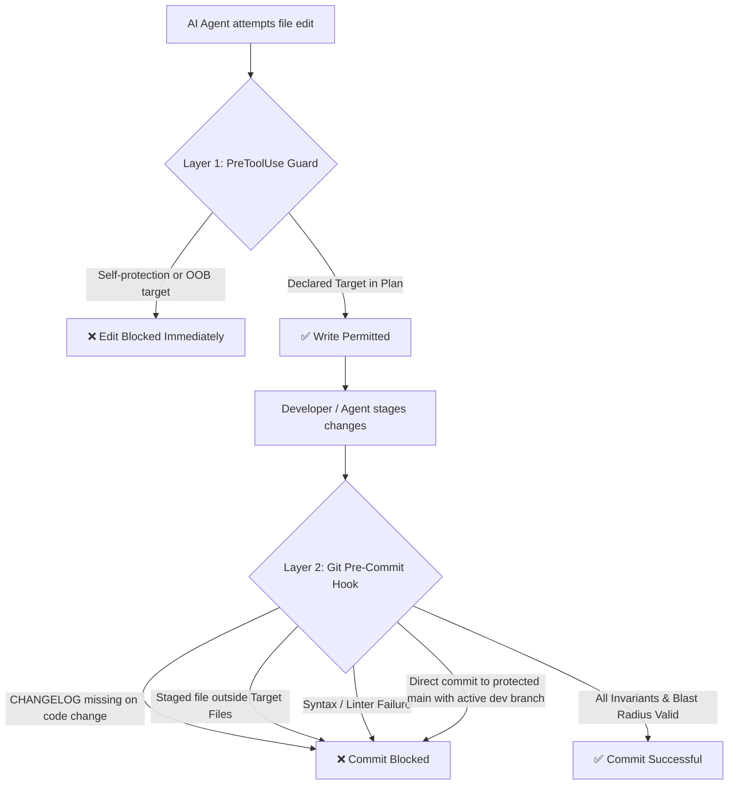

# 🤖 Asymmetric Agent Planning Protocol (AAPP)

> **Zero-Drift Autonomous Pair-Programming Architecture for Antigravity, Claude Code, Cursor, Copilot & AI Coding Agents.**  
> Completely decouples planning, agent rules, and git enforcement from your application source code using isolated Git worktrees mounted on orphan branches.
>
> 📚 **Deep Dive**: For the full architecture, Git plumbing, and operational guide, see [MANUAL.md](MANUAL.md).

---

## 📑 Table of Contents

* [1. Why AAPP? The Problem of Agent Drift](#1-why-aapp-the-problem-of-agent-drift)
* [2. The Core Architecture](#2-the-core-architecture)
* [3. Dual-Layer Blast Radius Enforcement](#3-dual-layer-blast-radius-enforcement)
* [4. Quick Start & Distribution Modes](#4-quick-start--distribution-modes)
  * [Option 1: Drop-In Project Setup (Self-Consuming)](#option-1-drop-in-project-setup-self-consuming)
  * [Option 2: Global Installation](#option-2-global-installation)
  * [Option 3: Contributor / Development Setup (`aapp develop`)](#option-3-contributor--development-setup-aapp-develop)
  * [The First-Run Onboarding Loop (Day 1 Experience)](#the-first-run-onboarding-loop-day-1-experience)
* [5. Branching Topologies & Adaptive Branch Protection](#5-branching-topologies--adaptive-branch-protection)
  * [Option A: Trunk-Based Development (Single Branch)](#option-a-trunk-based-development-single-branch)
  * [Option B: Dual-Branch Topology (Stable vs. Edge — Recommended)](#option-b-dual-branch-topology-stable-vs-edge--recommended)
  * [Smart Adaptive Branch Protection](#smart-adaptive-branch-protection)
* [6. Existing Project Conflicts, Adoption & Upgrades](#6-existing-project-conflicts-adoption--upgrades)
  * [Seamless Adoption & In-Place Protocol Upgrades](#seamless-adoption--in-place-protocol-upgrades)
  * [Existing Hook Managers (Husky, Lefthook, Native Hooks)](#existing-hook-managers-husky-lefthook-native-hooks)
* [7. Remote Sync & Multi-Machine Workflow](#7-remote-sync--multi-machine-workflow)
* [8. Daily Agent Workflow & Universal Skills](#8-daily-agent-workflow--universal-skills)
* [9. AI Attribution & Multi-Vendor Benchmarking (`aapp ai-*`)](#9-ai-attribution--multi-vendor-benchmarking-aapp-ai-)
* [10. Security, Threat Model & Trust Boundaries](#10-security-threat-model--trust-boundaries)
* [11. Testing & Verification Suites](#11-testing--verification-suites)
* [12. Blueprint Example & Technical Manual](#12-blueprint-example--technical-manual)
* [13. License](#13-license)

---

## 1. Why AAPP? The Problem of Agent Drift

Working with AI coding assistants through unconstrained flat chat creates **agent drift**:
* **Scope Creep**: The agent modifies unrelated files, rewrites existing helpers, or refactors working logic without permission.
* **Context Hallucination**: AI instructions, scratchpads, and planning state pollute your main code commits and git history, causing merge conflicts.
* **Lack of Invariants**: Changes bypass project boundaries, security perimeters, and documentation requirements.

### 🎯 The Solution: Deterministic Blast Radius
A frozen blueprint with a declared **Blast Radius** converts agent execution from probabilistic guesswork into a **deterministic structure**: the agent executes within the developer's exact architectural shape, and any file modifications outside declared boundaries are refused at both write-time and commit-time.

---

## 2. The Core Architecture

AAPP isolates planning, behavioral rules, and enforcement into **three Git worktrees mounted on independent orphan branches**:

```text
your-project/ (main/dev branch - contains application source code & public docs)
├── README.md            --> Public project overview & quickstart
├── CHANGELOG.md         --> Public release notes (default root; .plans/ supported)
├── ARCHITECTURE.md      --> Public system architecture & design invariants (or in .agents/)
├── .plans/              --> Worktree mounted on orphan branch 'plans'
│   ├── current/         --> Active RFC blueprints & plans (e.g. plan-auth.md)
│   ├── release/         --> Production checklists & release runbooks
│   ├── done/            --> Historical archives (000-archive-ledger.md & 000-issues-archive.md)
│   ├── aborted/         --> Discarded plans
│   ├── pickup.md        --> Fast agent scratchpad for active context
│   ├── ISSUES.md        --> Active flat technical backlog & defect ledger (Relocation Invariant)
│   ├── issues_road_map.md --> Defect priority board with ⭐ User Priority (auto-pruned by hook)
│   └── state_matrix.md  --> State matrix & active incubator brain
├── .agents/             --> Worktree mounted on orphan branch 'agents'
│   ├── AGENTS.md        --> Agent behavioral contracts & slash commands
│   ├── CODEMAP.md       --> Module ownership & structural interface mapping
│   └── PROJECT.MD       --> Master architectural specification & rules
├── .githooks/           --> Worktree mounted on orphan branch 'githooks'
│   ├── pre-commit       --> Master runner (dispatches checks, project-owned)
│   ├── aapp-pre-commit  --> Deterministic commit-time blast radius engine (managed by AAPP)
│   └── blast-radius-guard --> PreToolUse write-time guard for AI agents
└── .claude/
    └── settings.json    --> Wires write-time guard to Claude Code
```

### 💎 Key Architectural Benefits
1. **Zero Git History Pollution**: Your `main` branch contains only pure application code and public-facing documentation. Planning notes, RFCs, and prompt modifications never appear in application commit logs.
2. **Branch Independent**: Switch, rebase, or merge application feature branches without losing your active planning scratchpads or agent state.
3. **Multi-Agent Interoperability**: Antigravity, Claude Code, Cursor, Copilot, Gemini CLI, and human developers all share the same state and contracts.
4. **Dual-Location Flexibility**: Public-facing files (`CHANGELOG.md`, `ARCHITECTURE.md`) can live at the repository root or be fully decoupled into worktrees according to your project's preference.

---

## 3. Dual-Layer Blast Radius Enforcement

AAPP enforces safety across two complementary layers:



1. **Layer 1: Write-Time Hook (`.githooks/blast-radius-guard`)**
   - Intercepts AI tool executions across `Write`, `Edit`, `MultiEdit`, and `NotebookEdit`.
   - Prevents AI from tampering with enforcement hooks and configs (`.githooks/*`, `.claude/settings.json`, `.git/config`, `.cursor/rules/*`).
   - Rejects file modifications outside the active blueprint's declared `### 📂 Target Files`.
   - **Multi-Agent Allowlist**: Authorizes agent memory stores and scratchpads outside the repository (`~/.claude/`, `~/.gemini/`, `~/.codex/`, `~/.cursor/`, `/tmp/`, or via `git config aapp.allowPath`) with strict lexical canonicalization and credential protection.
   - **Fail-Open Safety**: Never bricks the developer when no active blueprints exist or on invalid inputs.

2. **Layer 2: Commit-Time Hook (`.githooks/aapp-pre-commit` / `.githooks/pre-commit`)**
   - Enforces `CHANGELOG.md` updates whenever core code changes.
   - Validates staged files against the active plan in `.plans/current/*.md`.
   - Supports concurrent active plans without cross-blocking.
   - Performs syntax checking on modified files.
   - **Adaptive Branch Protection**: Prevents accidental direct commits to `main` when active development branches exist.
   - **Roadmap Hygiene**: Automatically prunes resolved issues (`✅` or `Resolved`) from `issues_road_map.md` (<5ms), keeping the priority queue active-only.
   - Escape hatches available when needed: `SKIP_BLAST_RADIUS=1` or `ALLOW_MAIN_COMMIT=1`.

---

## 4. Quick Start & Distribution Modes

You can adopt AAPP in two ways: as a **self-consuming drop-in folder** for a single project, or as a **global installation** for reuse across all your repositories.

### Option 1: Drop-In Project Setup (Self-Consuming)
Ideal for single projects. Clones a self-contained folder directly into your project root:

```bash
cd /path/to/my-project

# 1. Clone into aapp-kit folder
git clone https://github.com/aapp-protocol/aapp-kit.git aapp-kit

# 2. Run initialization
./aapp-kit/aapp init
```

* **What it does:** Sets up `.plans/`, `.agents/`, and `.githooks/` worktrees, creates documentation anchors, wires hooks, and **consumes the `aapp-kit/` directory upon success**.
* **Clean & Reversible:** Right up until you run `aapp init`, you can cancel adoption with `rm -rf aapp-kit`.
* **Source retention:** Self-consumption is automatically skipped if the folder contains files or uncommitted modifications beyond the kit signature. If you intend to contribute to AAPP or develop the kit itself, use `aapp develop`.

### Option 2: Global Installation
Ideal for developers managing multiple projects:

```bash
# 1. Clone kit
git clone https://github.com/aapp-protocol/aapp-kit.git aapp-kit

# 2. Run global installer
./aapp-kit/aapp install
```

* **What it does:** Installs `aapp` into `$HOME/.local/bin/` and copies libraries/templates/tests to `${XDG_DATA_HOME:-$HOME/.local/share}/aapp-kit/`. Consumes the temporary clone folder once installed (unless extra files or uncommitted modifications are detected).
* **Usage in any project:**
  ```bash
  cd /path/to/any-project
  aapp init
  ```
* **Context Recovery Briefing:**
  ```bash
  aapp status
  ```
* **Updating Global Tools:**
  ```bash
  aapp upgrade
  ```
* **Uninstallation:**
  ```bash
  aapp uninstall
  ```
  Removes AAPP binary and share files while leaving shared directories and shell rc PATH configuration completely intact.

### Option 3: Contributor / Development Setup (`aapp develop`)
Ideal for core developers and contributors actively working on AAPP itself:

```bash
# 1. Clone kit to aapp-develop-kit
git clone https://github.com/aapp-protocol/aapp-kit.git aapp-develop-kit
cd aapp-develop-kit

# 2. Link repository globally for live development
./aapp develop
```

* **What it does:** Symlinks `~/.local/bin/aapp` and `~/.local/share/aapp-kit` directly to your local clone. All local edits to templates and libraries are **instantly live globally** across your machine without re-copying files or self-consuming.

### The First-Run Onboarding Loop (Day 1 Experience)
After initializing AAPP in your project, your project architecture files (`.agents/CODEMAP.md`, `ARCHITECTURE.md`, `.agents/PROJECT.MD`) are initialized with starter skeletons. Experience your first complete AAPP loop immediately:

1. **Inspect Pillars**: Open your AI agent and run `/aapp-status` (or `aapp status`). You will see an `Onboarding` item waiting in Pillar 4 (Pickup).
2. **Digest Blueprint**: Run `/aapp-digest Onboarding`. The agent will draft a blueprint (`P-1`) whose Blast Radius is strictly confined to `.agents/CODEMAP.md`, `ARCHITECTURE.md`, and `.agents/PROJECT.MD`.
3. **Freeze & Execute**: Run `/aapp-freeze-start P-1`. The agent inspects your codebase (directories, build manifests, dependencies, entrypoints) and populates your architecture maps.
4. **Archive**: Run `/aapp-done P-1`. The blueprint is permanently archived into `.plans/done/000-archive-ledger.md`. Your repository is now fully mapped and governed!

---

## 5. Branching Topologies & Adaptive Branch Protection

AAPP adapts seamlessly to how your team works, whether you prefer simple trunk-based development or a production-grade dual-branch model.

### Option A: Trunk-Based Development (Single Branch)
If your repository works directly on `main` (or `master`):
- All application commits occur on `main`.
- Planning (`.plans/`), rules (`.agents/`), and hooks (`.githooks/`) remain completely isolated on their orphan branches.
- **Zero friction**: The pre-commit hook automatically detects that no development branch exists, permitting direct commits to `main` without extra configuration.

### Option B: Dual-Branch Topology (Stable vs. Edge — Recommended)
To prevent unreleased features or experimental agent code from landing in production, adopt the **2-Rule Law**:
1. **Branch Law**:
   - `main` is strictly **STABLE** (contains only tagged releases, clean tags e.g. `v1.0.0`).
   - `develop` (or `dev`) is **EDGE** (active day-to-day engineering and feature incubation).
2. **Release Law**:
   - Development happens on `develop`.
   - Releases fast-forward cleanly into `main` before tagging:
     ```bash
     git checkout main
     git merge develop --ff-only
     git tag -a v1.0.1 -m "Release v1.0.1"
     ```

### Smart Adaptive Branch Protection
When a development branch (`develop`, `dev`, or `development`) exists, `.githooks/aapp-pre-commit` automatically activates branch protection:
- **Direct commits to protected branches (`main`, `master`, `production`) are refused** with clear guidance directing you to switch to your development branch.
- **Emergency Release/Hotfix Bypass**: If you intentionally need to commit directly to `main`:
  ```bash
  ALLOW_MAIN_COMMIT=1 git commit -m "hotfix: critical security patch"
  ```
- **Custom Branch Names**: If your team uses custom branch names (e.g. `staging` for development):
  ```bash
  git config aapp.devBranch "staging"
  git config aapp.protectedBranches "main production"
  ```
- **Opting Out**: To permanently disable branch protection for trunk-based development:
  ```bash
  git config --bool aapp.protectStable false
  ```

---

## 6. Existing Project Conflicts, Adoption & Upgrades

### Seamless Adoption & In-Place Protocol Upgrades
When `aapp init` runs against a project:
* **Deterministic Delimited Block Sync:** `aapp init` isolates the core protocol rules between `<!-- AAPP-PROTOCOL:START v1.0.0 -->` and `<!-- AAPP-PROTOCOL:END -->`.
  - **Adoption:** If your existing `.agents/AGENTS.md` does not have markers, the AAPP protocol block is cleanly appended, preserving all your custom rules above it.
  - **In-Place Upgrades:** If markers are present, running `aapp init` updates only the delimited protocol block to the latest version, preserving all custom rules above and below it.
  - **Legacy Flat Migration:** If a legacy `AGENTS.md` exists at the project root, it is automatically migrated into the `.agents/` worktree.
* **Core Infrastructure Sync:** `.githooks/aapp-pre-commit` and `.githooks/blast-radius-guard` are deterministically updated to the latest version and made executable, while `.githooks/pre-commit` is guarded.
* **Non-Destructive `.claude/settings.json` Merge:** Existing Claude Code settings and custom hooks are preserved, and the `PreToolUse` blast-radius guard is merged safely.
* **Automatic Consumption:** In drop-in mode, `aapp init` automatically consumes the temporary `aapp-kit/` directory upon success.

### Existing Hook Managers (Husky, Lefthook, Native Hooks)
If your repository already uses a hook manager (`core.hooksPath` set to `.husky` or `.lefthook`) or has an executable `.git/hooks/pre-commit`:
* `aapp init` **will never overwrite your Git hook configuration**.
* It installs the AAPP hooks into `.githooks/` and prints the non-destructive subprocess wiring line:

```sh
"$(git rev-parse --show-toplevel)/.githooks/aapp-pre-commit" || exit 1
```

> [!TIP]
> **Subprocess Execution**: Paste this line into your existing hook script. Executing as a subprocess preserves exit codes and ensures `SKIP_BLAST_RADIUS=1` propagates cleanly without prematurely terminating your caller hook.

---

## 7. Remote Sync & Multi-Machine Workflow

AAPP worktrees exist on separate orphan branches (`plans`, `agents`, `githooks`). AAPP provides native, automated commands to synchronize all active worktrees with remote repositories in a single step:

### Automated Remote Synchronization
```bash
# Push all active worktrees to remote (sets upstream tracking on first push)
aapp push [remote] [strategy]

# Pull remote updates across all worktrees with strict --ff-only safety
aapp pull [remote] [strategy]

# Bi-directional sync: pull updates followed by push
aapp sync [remote] [strategy]
```

### Safety Invariants & Pre-Flight Checks
* **Strict Atomicity**: Before performing `pull` or `sync`, AAPP verifies that all active worktrees are clean. If any worktree contains uncommitted modifications, the operation immediately halts before touching any branch, preserving uncommitted drafts and preventing merge conflicts.
* **Non-Negotiable Fast-Forward**: `aapp pull` strictly defaults to `--ff-only`. Non-fast-forward divergence requires manual inspection in the affected worktree.
* **Three-Tier Precedence & Team Governance**:
  1. **CLI Positional Override**: `aapp sync origin hook` or `aapp sync origin builtin` overrides all settings for that invocation.
  2. **Local Clone Override**: `git config aapp.syncStrategy [builtin|hook]` lets individual developers override team defaults in their local clone.
  3. **Committed Team Standard**: Repositories registering an `on-sync` lifecycle gate in `.agents/skills/aapp-hooks/registry.tsv` default to delegated hook transport; otherwise, core native git worktree sync executes by default.
* **Fail-Closed Missing Hook Refusal**: If strategy resolves to `hook` but no executable handler is registered for `on-sync`, AAPP strictly refuses rather than silently degrading or skipping transport.

### Configuration (`git config aapp.*`)
| Key | Default | Description |
| :--- | :--- | :--- |
| `aapp.remote` | `origin` | Target git remote for worktree sync operations. |
| `aapp.syncWorktrees` | `"plans agents githooks"` | Space-delimited list of worktree paths to sync. |
| `aapp.pullStrategy` | `"ff-only"` | Pull strategy (`ff-only`, `rebase`, `merge`). |
| `aapp.syncStrategy` | `"builtin"` | Transport strategy: `builtin` (native git) or `hook` (delegated to `on-sync`). |

### Restoring on a New Machine / CI
When cloning your repository onto a second workstation:
```bash
git clone <your-repo-url> my-project
cd my-project

# Initialize and mount existing remote orphan branches
aapp init
```
`aapp init` automatically detects `origin/plans`, `origin/agents`, and `origin/githooks` and mounts tracking worktrees without conflict warnings.

---

## 8. Daily Agent Workflow & Universal Skills

AAPP ships core lifecycle verbs as **Universal AAPP Skills** (`skills/<name>/SKILL.md`) natively stored in the orphan `agents` worktree (`.agents/skills/`) and bridged to Claude Code (`.claude/skills/`).

### Cross-Agent Progressive Disclosure & Compatibility
* **Universal Discovery**: Skills follow the standard depth-1 invariant (`skills/*/SKILL.md`), enabling out-of-the-box discovery in **Google Antigravity**, **Anthropic Claude Code**, **Cursor**, and **OpenAI Codex**.
* **Progressive Disclosure**: Agents only index lightweight names and descriptions (~100 tokens), loading full execution procedures on-demand when triggered.
* **Execution Models**: Long-running preflight checks (`/aapp-release`) run in an isolated subagent fork (`context: fork`), while conversational workflows (`/aapp-digest`, `/aapp-status`) run inline to preserve active conversation context.

| Slash Command | Natural Alias | Lifecycle Phase | Description |
| :--- | :--- | :--- | :--- |
| `/aapp-status` | `status`, `/status`, `/aapp status` | **Orient** | Scan four pillars (Shipped, Issues, Plans, Pickup) to report current posture. |
| `/aapp-digest <idea>` | `digest <idea>`, `/digest` | **Ingest** | Ingest idea into Issue Lane (`ISSUES.md`) or Plan Lane (`.plans/current/`). |
| `/plan <idea>` | `/aapp-plan`, `aapp plan-status` | **Plan** | Author durable blueprints under Git Blast Radius; inspect status matrix. |
| `/aapp-active <plan>` | `aapp active [id]`, `active` | **Switch** | Manage active execution plan buffer (`.git/aapp_active_plan`). |
| `/aapp-freeze <plan>` | `freeze <plan>`, `/freeze` | **Lock** | Lock Blast Radius boundaries and greenlight blueprint for execution. |
| `/aapp-done <plan>` | `done <plan>`, `/done` | **Archive** | Move plan to `done/`, append to `000-archive-ledger.md`, and clean `state_matrix.md`. |
| `/aapp-release <ver>` | `release <ver>`, `/preflight` | **Preflight** | Execute release verification runbook and check changelog staging. |
| `/aapp-pause [reason]` | `pause`, `aapp pause`, `/aapp-pause` | **Hibernate** | Emergency brake: quarantine in-flight work into SHA stashes, freeze edits. |
| `/aapp-pause resume` | `resume`, `aapp resume`, `unpause` | **Wake** | Verify drift, restore stashes by SHA, run health checks, and wake workspace. |

### Master Emergency Brake & State Preserver ("Hibernate & Wake")
When switching focus to another project, stepping away from the desk, or preventing accidental cross-window modifications:
- **Engage**: `aapp pause "switching to project-2"` (or `/aapp-pause`). Automatically discovers all worktrees (`git worktree list --porcelain`), verifies no in-flight merges/rebases, and quarantines uncommitted changes per-worktree into SHA-addressed stashes (`aapp-pause-<timestamp>:<branch>`). Codebase modifications and commits are strictly locked.
- **Inspect**: Running `aapp pause` while paused (or `aapp status`) acts as an idempotent inspector displaying pause reason, elapsed duration, and quarantined worktrees.
- **Wake**: `aapp resume` verifies commit drift against the pause snapshot, restores stashes per-worktree by commit SHA (keeping stashes intact on conflict), runs planning health checks, and disengages the circuit breaker.

### Blueprint Anatomy (Blast Radius Declaration)
Every plan in `.plans/current/<name>.md` defines strict boundaries:

```markdown
# 🗺️ Plan: Authentication Refactor
* **Status:** 🔷 Ready for Execution

## 💥 3. Blast Radius & System Boundaries

### 📂 Target Files (Modifications & Additions)
- [ ] `src/Auth/TokenManager.php` -> Token rotation logic
- [ ] NEW FILE -> `src/Auth/SessionGuard.php` -> New session validator
- [ ] `schema/auth.json` -> Schema updates

### 🛑 Out of Bounds (Do Not Touch)
- [ ] `src/Database/Connection.php` -> Core connection pool is frozen
- [ ] `src/Billing/` -> Financial transactions are out of scope
```

---

## 9. AI Attribution & Multi-Vendor Benchmarking (`aapp ai-*`)

AAPP replaces insecure, synthetic co-author emails (`Co-authored-by: Agent <email>`) with an explicit, multi-mode AI attribution suite governed by repository configuration (`git config aapp.aiAttribution`):

```bash
aapp ai-status   # Display active mode, subject max length, and pending notes
aapp ai-commit   # Switch to public, emailless semantic git trailers (AI-Agent:)
aapp ai-notes    # Switch to local-first / private git notes (refs/notes/commits)
aapp ai-off      # Disable AI attribution (pure human commit messages)
aapp ai-credits  # Generate or update AI Contributors roster in README.md
```

### Attribution Modes & Security Model
| Mode | Command | Scope & Behavior |
| :--- | :--- | :--- |
| `none` | `aapp ai-off` | **Default.** Pure human authoring. Any accidental AI trailers are caught and blocked by `commit-msg`. |
| `commit` | `aapp ai-commit` | **Public attribution.** Requires emailless semantic trailers (`AI-Agent:`, `AI-Vendor:`, `AI-Model:`). Synthetic emails (`Co-authored-by:`) are strictly prohibited to prevent GitHub account hijacking. |
| `notes` | `aapp ai-notes` | **Local-first / private benchmarking.** Keeps commit messages pristine. Attribution metadata attaches to `refs/notes/commits` via `aapp ai-note --stage` and `post-commit`. |

### The Mode Boundary (§E.8 Rationale)
Choosing `ai-notes` is a decision to keep the record of AI involvement internal — a legitimate one, and often the point of the mode. A tool that then published a roster distilled from that record would defeat it. The `AI Contributors` footer therefore follows the public record (trailers) and never the private one (notes). In `notes` mode, `aapp ai-credits` is an explanatory no-op that neither generates nor erases a hand-maintained block.

---

## 10. Security, Threat Model & Trust Boundaries

AAPP is an **alignment, cognitive-drift prevention, and architectural governance framework**, not an adversarial execution sandbox.

* **Collaborative Pair-Programming Trust Assumption:** AAPP assumes the AI agent operates in good faith according to `.agents/AGENTS.md`. It provides the rails, signaling, and mechanical verification needed to keep an aligned agent disciplined.
* **Cognitive Drift vs. Malice:** AI coding agents fail predominantly due to *context window compaction*, *hallucinated scope*, and *overeagerness*—never conscious malice. AAPP's mechanical layers (`blast-radius-guard`, `pre-commit`, design locks) act as high-friction tactile guardrails that intercept unforced errors and accidental scope creep before touching disk or entering Git history.
* **Friction and Semantic Signaling:** When a guard refuses an action, it does not treat the agent as an adversary; it provides structured, deterministic feedback that snaps the model back to the blueprint and forces explicit conversation with the developer.
* **Adversarial Containment is an Adopter / Host Responsibility (Layer 0):** AAPP provides repository-level engineering governance (Layers 1–3). Because coding agents require terminal/shell execution (`run_command`, `Bash`), true process and network isolation cannot be solved at the Git-hook layer—it is the adopter's responsibility to wrap agent environments in containerized sandboxes (e.g., Dev Containers, Docker, or gVisor) when running untrusted models. AAPP governs *software engineering lifecycle discipline*, operating inside the developer's execution environment.

---

## 11. Testing & Verification Suites

AAPP includes 188 automated regression test cases verifying hook enforcement, write-guard protection, branch protection, skill synchronization, flat issue ledger, Plan ID shorthand resolution, six-pair planning-health validation, and the AI attribution switchboard:

```bash
# Run complete test verification suite (188 tests)
./tests/install_test.sh && ./tests/pre-commit_test.sh && ./tests/write-guard_test.sh && ./tests/plan_resolver_test.sh && ./tests/ai_attribution_test.sh
```

| Suite | File | Tests | Coverage |
| :--- | :--- | :--- | :--- |
| **CLI & Upgrades** | [tests/install_test.sh](tests/install_test.sh) | 47 cases | Drop-in / global resolution, verbs (`init`, `install`, `upgrade`, `uninstall`, `status`, `develop`), self-consumption protection, in-place block upgrades, migration, `.claude/settings.json` decoupling & merge, Universal Skills sync, drift control, archive provisioning, non-destructive custom `ISSUES.md` advisory, flat schema, Plan ID template headers. |
| **Commit-Time Guard** | [tests/pre-commit_test.sh](tests/pre-commit_test.sh) | 34 cases | Spaces in filenames, concurrent plan isolation, prose backtick isolation, always-allowed invariant anchors (`CHEATSHEET.md`, `README.md`, etc.), BLOCKED plan refusal regex, pure POSIX JSON parser, non-executable hook execution, adaptive branch protection, POSIX ID-anchored roadmap auto-pruning, detect-and-block Relocation Invariant, planning-health Pairs 1–5 integrity validation, git-verified worktree changelog checks. |
| **Write-Time Guard** | [tests/write-guard_test.sh](tests/write-guard_test.sh) | 49 cases | PreToolUse Claude Code JSON payload, self-protection invariants (`.agents/claude/*`, `.claude/settings.json`, `.git/config`, `.agents/skills/aapp-*`, `.claude/skills/aapp-*`), invariant anchors (`CHEATSHEET.md`, `CHANGELOG.md`), Section 2b external hard-deny (credentials, shell rc, local bin), Section 2c external path allowlist (Claude, Antigravity, temp, git config `aapp.allowPath`), lexical canonicalization traversal prevention, `MultiEdit` matcher coverage, fail-open behavior, OOB denial, pure POSIX json parser fallback, large ARG_MAX payload streaming. |
| **Plan Resolver & Health** | [tests/plan_resolver_test.sh](tests/plan_resolver_test.sh) | 24 cases | Plan ID resolution (`P-9`, `9`, `P13`), slug matching, Issue `#` collision rejection, transition verb empty-query guards, `get_plan_id`/`get_next_plan_id`, Pair 4 Plan ID uniqueness, Pair 5 Section 2 target blocks, Pair 6 Recorded SHA Integrity. |
| **AI Attribution Suite** | [tests/ai_attribution_test.sh](tests/ai_attribution_test.sh) | 34 cases | Default `none` config, switchboard transitions, refspec idempotency, commit-msg conciseness (<=72 chars) and trailer checks, revert bypass, Option C hash-keyed note staging and post-commit attachment, amend durability (`notes.rewriteRef`), TTL reaping, failure safety, `ai-credits` mode boundary, `LC_ALL=C` sorting, and alias mapping. |

---

## 12. Blueprint Example & Technical Manual
 
* **Complete Blueprint Example**: See [examples/example-plan-distribution-rework.md](examples/example-plan-distribution-rework.md) for a real-world, fully refined AAPP blueprint demonstrating Blast Radius declarations, technical decision logs (Q1–Q9), and verification matrix.
* **Comprehensive Technical Manual**: See [MANUAL.md](MANUAL.md) for low-level Git worktree plumbing, Two Lanes protocol, state machine lifecycle, multi-agent IDE integration, hook manager recipes, and operations.

---

## 13. License

Released under the [BSD 3-Clause License](LICENSE).

<!-- AAPP-AI-CREDITS:START -->
## AI Contributors

The following AI coding agents contributed to this codebase — planning, code, and review.
Listed alphabetically; the ordering carries no meaning, and no division of work is implied.

- Antigravity (Google)
- Claude (Anthropic)

Authorship of, and responsibility for, this code rest with its human contributors.
<!-- AAPP-AI-CREDITS:END -->
